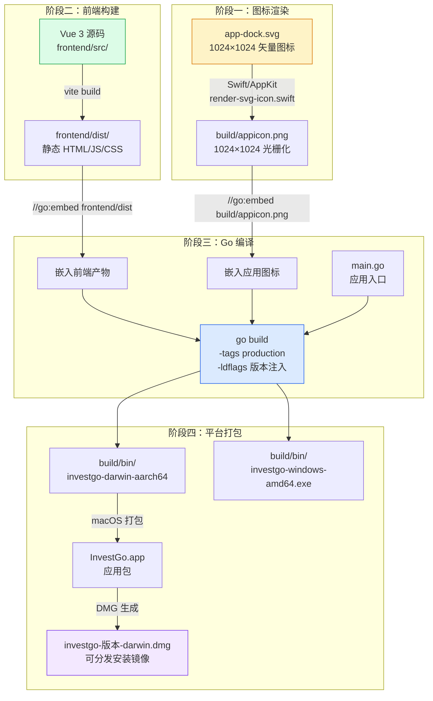
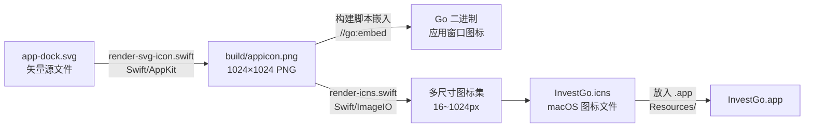
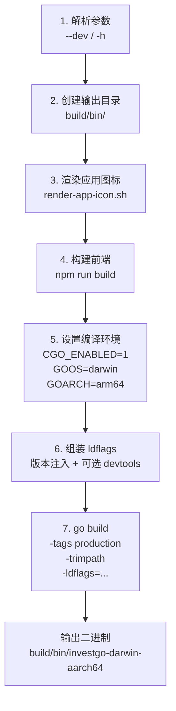
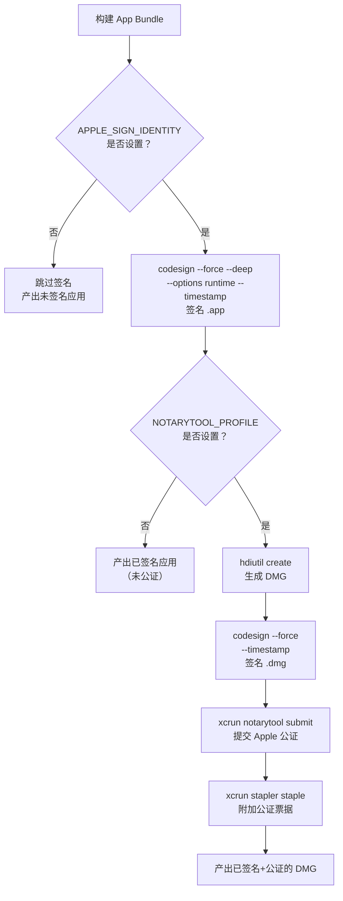

本文档系统讲解 InvestGo 桌面应用从源码到可分发产物的完整构建与打包流程。你将了解构建管线的各个阶段、平台特定的构建脚本、版本注入机制、macOS 应用打包与 DMG 生成，以及代码签名和公证的配置方法。阅读完本文后，你可以独立完成项目构建并产出可分发安装包。

Sources: [scripts/build-darwin-aarch64.sh](scripts/build-darwin-aarch64.sh#L1-L78) [scripts/package-darwin-aarch64.sh](scripts/package-darwin-aarch64.sh#L1-L275) [main.go](main.go#L1-L189)

## 构建管线总览

InvestGo 采用 **前端构建 → 资源嵌入 → Go 编译 → 平台打包** 的四阶段管线。前端通过 Vite 构建为静态产物，Go 编译时通过 `//go:embed` 将前端产物和应用图标打包进二进制文件，最终通过平台特定脚本将二进制封装为可分发的应用包。



理解这个管线的核心在于：**每一个阶段都产生下一阶段所需的输入**，任何阶段失败都会中断整个流程。构建脚本自动化了这四个阶段，你只需执行一条命令即可从源码产出最终产物。

Sources: [scripts/build-darwin-aarch64.sh](scripts/build-darwin-aarch64.sh#L53-L77) [main.go](main.go#L28-L36) [vite.config.ts](vite.config.ts#L11-L17)

## 前端构建

前端构建是管线的第二步（图标渲染之后），负责将 Vue 3 源码编译为浏览器可执行的静态文件。Vite 在 `frontend/` 目录下执行构建，产物输出到 `frontend/dist/`。

| 配置项 | 值 | 说明 |
|--------|-----|------|
| **root** | `frontend` | Vite 项目根目录指向 `frontend/`，而非仓库根 |
| **outDir** | `dist` | 产物输出到 `frontend/dist/`（相对于 root） |
| **emptyOutDir** | `true` | 每次构建前清空输出目录 |
| **assetsDir** | `assets` | 静态资源子目录名 |
| **chunkSizeWarningLimit** | `1000` | 分块大小警告阈值提升至 1MB |

前端构建命令为 `npm run build`（对应 `vite build`），构建脚本会在 Go 编译前自动调用此命令。产物目录 `frontend/dist/` 通过 Go 的 `//go:embed frontend/dist` 指令整体嵌入二进制，运行时由 `application.BundledAssetFileServer()` 提供静态文件服务。这意味着 **构建后的桌面应用完全不依赖外部文件服务器**，前端资源直接从 Go 二进制内存中读取。

Sources: [vite.config.ts](vite.config.ts#L1-L17) [main.go](main.go#L28-L36) [main.go](main.go#L93-L100) [package.json](package.json#L3-L4)

## 图标渲染管线

应用图标是桌面应用的重要视觉标识。InvestGo 的图标源文件是 SVG 矢量格式（`frontend/src/assets/app-dock.svg`），需要通过 Swift/AppKit 渲染为 PNG 格式后才能被 Go 嵌入和 macOS 图标系统使用。



**渲染脚本工作原理**：`render-svg-icon.swift` 使用 macOS 原生的 `NSImage` 加载 SVG，在指定尺寸的 `NSBitmapImageRep` 画布上绘制，最终编码为 PNG 输出。`render-icns.swift` 则使用 `CGImageDestination` 创建 ICNS 容器，将同一张源图渲染为 16、32、64、128、256、512、1024 七个尺寸后一并写入。整个图标渲染链仅依赖 macOS 自带的 Swift 运行时和 AppKit 框架，无需安装额外工具。

Sources: [scripts/render-app-icon.sh](scripts/render-app-icon.sh#L1-L31) [scripts/render-svg-icon.swift](scripts/render-svg-icon.swift#L1-L74) [scripts/render-icns.swift](scripts/render-icns.swift#L1-L82) [main.go](main.go#L33-L36)

## 版本注入机制

InvestGo 的版本号不是硬编码在源码中的，而是在 **Go 编译时通过链接器标志动态注入**。这种模式允许同一段源码产出不同版本号的构建产物，是 Go 语言项目中常见的版本管理实践。

`main.go` 中声明了三个可注入变量，默认值均面向开发场景：

| 变量 | 默认值 | 注入方式 | 作用 |
|------|--------|---------|------|
| `appVersion` | `"dev"` | `-X main.appVersion=<版本>` | 应用版本号，传递给 Store 并暴露给前端 |
| `defaultTerminalLogging` | `"0"` | `-X main.defaultTerminalLogging=1` | 是否默认启用终端日志输出 |
| `defaultDevToolsBuild` | `"0"` | `-X main.defaultDevToolsBuild=1` | 是否默认启用 F12 开发者工具 |

**生产构建**的 ldflags 仅注入版本号：`-s -w -X main.appVersion=<版本>`，其中 `-s -w` 剥离调试符号以减小二进制体积。**开发构建**（`--dev`）额外注入两个标志以启用终端日志和 DevTools，同时添加 `devtools` 构建标签。

Sources: [main.go](main.go#L24-L26) [scripts/build-darwin-aarch64.sh](scripts/build-darwin-aarch64.sh#L68-L75) [scripts/build-windows-amd64.ps1](scripts/build-windows-amd64.ps1#L90-L95)

## 平台构建脚本详解

InvestGo 为 macOS 和 Windows 各提供了一套构建脚本。macOS 脚本以 Bash 编写，Windows 脚本以 PowerShell 编写，两者逻辑对称但平台适配不同。

### 构建脚本对比

| 维度 | macOS | Windows |
|------|-------|---------|
| **脚本语言** | Bash（`.sh`） | PowerShell（`.ps1`）+ `.bat` 包装 |
| **架构支持** | Apple Silicon (`arm64`) + Intel (`amd64`) | 仅 `amd64` |
| **CGO** | `CGO_ENABLED=1`（必需） | `CGO_ENABLED=0`（纯 Go） |
| **图标处理** | Swift/AppKit 渲染 SVG → PNG | 直接复制 PNG（仅需 ImageMagick 处理非 PNG 源） |
| **最小系统版本** | macOS 13.0（通过 `MACOSX_DEPLOYMENT_TARGET`） | 无特殊约束 |
| **依赖检测** | `set -euo pipefail` 快速失败 | `Require-Command` 函数检查并提示安装命令 |
| **构建标签** | `production` / `production devtools` | `production` / `production devtools` |

Sources: [scripts/build-darwin-aarch64.sh](scripts/build-darwin-aarch64.sh#L60-L77) [scripts/build-windows-amd64.ps1](scripts/build-windows-amd64.ps1#L86-L101)

### macOS 构建脚本

macOS 有两个构建脚本，`build-darwin-x86_64.sh` 是 `build-darwin-aarch64.sh` 的薄包装——仅覆盖 `DARWIN_GOARCH=amd64` 和 `DARWIN_PLATFORM_NAME=x86_64` 两个环境变量后调用核心脚本。核心脚本执行以下步骤：



macOS 构建必须启用 CGO（`CGO_ENABLED=1`），因为 Wails v3 在 macOS 上依赖系统原生框架。脚本同时设置了 `MACOSX_DEPLOYMENT_TARGET`、`CGO_CFLAGS` 和 `CGO_LDFLAGS` 为 `MACOS_MIN_VERSION`（默认 13.0），确保编译产物能在目标最低版本上运行。

Sources: [scripts/build-darwin-aarch64.sh](scripts/build-darwin-aarch64.sh#L13-L77) [scripts/build-darwin-x86_64.sh](scripts/build-darwin-x86_64.sh#L1-L10)

### Windows 构建脚本

Windows 构建脚本以 PowerShell 编写，并附带一个 `.bat` 包装器。`.bat` 文件的作用是绕过 PowerShell 执行策略（`-ExecutionPolicy Bypass`）并在失败时暂停窗口，使错误信息不会一闪而过。

脚本的特色功能是 `Require-Command` 函数：当检测到缺少 `npm`、`go` 或 `magick` 时，不仅报错，还打印对应的 `winget install` 安装命令，降低新手入门门槛。Windows 构建使用 `CGO_ENABLED=0` 纯 Go 编译，无需 C 工具链，降低了构建环境复杂度。

Sources: [scripts/build-windows-amd64.ps1](scripts/build-windows-amd64.ps1#L13-L29) [scripts/build-windows-amd64.bat](scripts/build-windows-amd64.bat#L1-L23) [scripts/build-windows-amd64.ps1](scripts/build-windows-amd64.ps1#L86-L101)

### 构建命令速查

**macOS Apple Silicon（M 系列）**：

```bash
# 生产构建
./scripts/build-darwin-aarch64.sh

# 指定版本号
VERSION=1.0.0 ./scripts/build-darwin-aarch64.sh

# 开发构建（启用 DevTools）
./scripts/build-darwin-aarch64.sh --dev
```

**macOS Intel**：

```bash
./scripts/build-darwin-x86_64.sh
```

**Windows**：

```powershell
# PowerShell 直接调用
.\scripts\build-windows-amd64.ps1

# 指定版本号
$env:VERSION="1.0.0"; .\scripts\build-windows-amd64.ps1

# 开发构建
.\scripts\build-windows-amd64.ps1 -Dev

# 通过 .bat 包装（自动绕过执行策略）
scripts\build-windows-amd64.bat
```

Sources: [README.md](README.md#L97-L127) [scripts/build-darwin-aarch64.sh](scripts/build-darwin-aarch64.sh#L1-L8)

### 构建环境变量一览

| 变量 | 适用平台 | 默认值 | 说明 |
|------|---------|--------|------|
| `VERSION` | 全平台 | 无（`APP_VERSION` 退回 `-dev`） | 注入的应用版本号 |
| `APP_VERSION` | 全平台 | `${VERSION:--dev}` | 优先级高于 `VERSION` 的版本号 |
| `OUTPUT_FILE` | macOS | `build/bin/investgo-darwin-<arch>` | 二进制输出路径 |
| `OUTPUT_FILE` | Windows | `build/bin/investgo-windows-amd64.exe` | 二进制输出路径 |
| `DARWIN_GOARCH` | macOS | `arm64` | Go 目标架构 |
| `DARWIN_PLATFORM_NAME` | macOS | `aarch64` | 平台标识（影响输出文件名） |
| `MACOS_MIN_VERSION` | macOS | `13.0` | 最低 macOS 部署目标 |
| `MACOSX_DEPLOYMENT_TARGET` | macOS | 同 `MACOS_MIN_VERSION` | macOS SDK 部署目标 |
| `GOCACHE` | 全平台 | macOS: `/tmp/go-build-cache`<br/>Windows: `%TEMP%\go-build-cache` | Go 构建缓存目录 |
| `ICON_SOURCE` | Windows | `frontend/src/assets/appicon.png` | 图标源文件路径 |
| `APP_ICON_OUTPUT_FILE` | Windows | `build/appicon.png` | 渲染后的图标输出路径 |
| `ICON_SIZE` | Windows | `1024` | 图标渲染尺寸 |

Sources: [scripts/build-darwin-aarch64.sh](scripts/build-darwin-aarch64.sh#L14-L19) [scripts/build-windows-amd64.ps1](scripts/build-windows-amd64.ps1#L1-L53) [README.md](README.md#L133-L148)

## macOS 应用打包与 DMG 生成

构建脚本产出的是裸二进制文件，无法直接作为 macOS 应用分发。macOS 打包脚本 (`package-darwin-aarch64.sh`) 将二进制封装为标准的 `.app` 应用包，并进一步生成 `.dmg` 安装镜像。

### App Bundle 结构

macOS 应用包是一个以 `.app` 为后缀的目录，内部遵循 Apple 定义的标准布局：

```
InvestGo.app/
└── Contents/
    ├── Info.plist          ← 应用元数据（名称、版本、图标引用等）
    ├── PkgInfo             ← 类型标识（APPL????）
    ├── MacOS/
    │   └── investgo        ← 可执行二进制
    └── Resources/
        └── InvestGo.icns   ← 应用图标（多尺寸）
```

打包脚本在 `build_app_bundle()` 函数中完成这一组装：先调用构建脚本编译二进制到 `MacOS/investgo`，然后通过 `render-icns.swift`（优先）或 `sips` + `iconutil`（回退方案）生成 ICNS 图标文件放入 `Resources/`，最后通过模板替换生成 `Info.plist` 并写入 `PkgInfo`。

Sources: [scripts/package-darwin-aarch64.sh](scripts/package-darwin-aarch64.sh#L173-L208)

### ICNS 图标生成的双路径策略

ICNS 是 macOS 专用的图标容器格式，内含 16px 到 1024px 的多个分辨率。打包脚本提供两种生成方式，优先使用 Swift 脚本，失败时回退到命令行工具：

| 方式 | 工具 | 依赖 | 说明 |
|------|------|------|------|
| **优先** | `render-icns.swift` | Xcode CLT（`swift`） | 使用 `CGImageDestination` 直接生成 ICNS，高质量缩放 |
| **回退** | `sips` + `iconutil` | macOS 内置 | 生成 `.iconset` 目录后转换为 ICNS，兼容性更好 |

`generate_icns()` 函数会检测 `render-icns.swift` 是否存在且 `swift` 命令是否可用，优先尝试 Swift 路径。如果生成的 ICNS 文件为空（渲染失败），则回退到 `sips` + `iconutil` 方案。两种方式都能产出合规的 ICNS 文件，确保在不同 macOS 版本上均可正常显示应用图标。

Sources: [scripts/package-darwin-aarch64.sh](scripts/package-darwin-aarch64.sh#L105-L136) [scripts/render-icns.swift](scripts/render-icns.swift#L1-L82)

### DMG 安装镜像生成

DMG（Disk Image）是 macOS 上常见的应用分发格式，用户挂载后拖拽即可安装。打包脚本通过 `create_dmg()` 函数完成 DMG 生成：


脚本使用 `ditto`（而非 `cp`）复制 App Bundle，以保留 macOS 扩展属性和资源分支。在 staging 目录中创建指向 `/Applications` 的符号链接，使用户挂载 DMG 后可以直接将应用拖入应用程序文件夹。最终通过 `hdiutil create -format UDZO` 创建压缩格式的 DMG 镜像。

Sources: [scripts/package-darwin-aarch64.sh](scripts/package-darwin-aarch64.sh#L210-L232)

### 打包命令速查

```bash
# macOS Apple Silicon：构建 + 打包 + 生成 DMG
./scripts/package-darwin-aarch64.sh

# 指定版本号（影响 DMG 文件名和 Info.plist）
VERSION=1.0.0 ./scripts/package-darwin-aarch64.sh

# 开发构建打包
./scripts/package-darwin-aarch64.sh --dev

# macOS Intel
./scripts/package-darwin-x86_64.sh
```

Intel 打包脚本同样是 Apple Silicon 版本的薄包装，仅覆盖 `DARWIN_PLATFORM_NAME=x86_64` 和 `DARWIN_BUILD_SCRIPT` 指向 x86_64 构建脚本。

Sources: [scripts/package-darwin-aarch64.sh](scripts/package-darwin-aarch64.sh#L1-L12) [scripts/package-darwin-x86_64.sh](scripts/package-darwin-x86_64.sh#L1-L10)

### 打包环境变量

| 变量 | 默认值 | 说明 |
|------|--------|------|
| `APP_NAME` | `InvestGo` | 应用显示名称 |
| `BINARY_NAME` | `investgo` | 可执行文件名 |
| `VERSION` | `0.1.0` | 版本号（影响 Info.plist 和 DMG 文件名） |
| `APP_ID` | `com.example.investgo` | macOS 应用标识符 |
| `MACOS_MIN_VERSION` | `13.0` | 最低系统版本 |
| `VOLUME_NAME` | `InvestGo` | DMG 卷标名 |
| `ICON_SOURCE` | `build/appicon.png` | 图标源文件路径 |
| `SKIP_APP_BUILD` | `0` | 设为 `1` 跳过二进制构建（仅重新打包） |
| `SKIP_DMG_CREATE` | `0` | 设为 `1` 跳过 DMG 生成（仅生成 .app） |
| `APPLE_SIGN_IDENTITY` | 空 | 设置后启用代码签名 |
| `NOTARYTOOL_PROFILE` | 空 | 设置后启用公证（需同时设置签名） |
| `DARWIN_PLATFORM_NAME` | `aarch64` / `x86_64` | 影响输出文件名中的架构标识 |

Sources: [scripts/package-darwin-aarch64.sh](scripts/package-darwin-aarch64.sh#L14-L39) [README.md](README.md#L200-L212)

## 代码签名与公证

对于希望公开发布 macOS 应用的开发者，打包脚本内置了 Apple 代码签名和公证流程的支持。这是 macOS 应用通过 Gatekeeper 验证的必要步骤。



**签名**使用 `codesign --force --deep --options runtime --timestamp`，其中 `--options runtime` 启用 Hardened Runtime，这是 Apple 公证的前提条件。**公证**通过 `xcrun notarytool submit --wait` 提交到 Apple 服务器并等待结果，成功后通过 `xcrun stapler staple` 将公证票据附加到 DMG 文件上。注意公证要求 DMG 必须先生成，因此 `SKIP_DMG_CREATE=1` 与 `NOTARYTOOL_PROFILE` 互斥。

Sources: [scripts/package-darwin-aarch64.sh](scripts/package-darwin-aarch64.sh#L138-L171) [scripts/package-darwin-aarch64.sh](scripts/package-darwin-aarch64.sh#L246-L260)

### 未签名应用的处理

当前项目的公共构建产物未进行 Developer ID 签名和公证。macOS Gatekeeper 会阻止未签名应用的启动，并可能显示"应用已损坏"的提示。解决方法是在信任该构建的前提下，移除隔离属性：

```bash
# 对已安装的应用移除隔离属性
xattr -dr com.apple.quarantine /Applications/InvestGo.app

# 或在下载 DMG 后、挂载前清除
xattr -d com.apple.quarantine ~/Downloads/investgo-<version>-darwin-aarch64.dmg
```

**重要提醒**：仅在确认构建来源可信时执行此操作，全局禁用 Gatekeeper 是不安全的做法。

Sources: [README.md](README.md#L178-L196)

## 构建产物与输出路径

所有构建产物统一输出到项目根目录下的 `build/` 目录，该目录已在 `.gitignore` 中排除。

```
build/                              ← 构建输出根目录（.gitignore 排除）
├── appicon.png                     ← 渲染后的 1024×1024 应用图标
├── InvestGo.iconset/               ← ICNS 中间产物（打包后清理）
├── InvestGo.icns                   ← macOS 图标文件（打包后清理）
├── Info.plist.template             ← Info.plist 模板
├── dmg-staging/                    ← DMG 临时暂存目录（打包后清理）
├── macos/                          ← macOS App Bundle 临时目录
│   └── InvestGo.app/               ← 完整应用包
└── bin/                            ← 最终产物目录
    ├── investgo-darwin-aarch64     ← macOS ARM64 裸二进制
    ├── investgo-darwin-x86_64      ← macOS Intel 裸二进制
    ├── investgo-windows-amd64.exe  ← Windows 可执行文件
    ├── investgo-0.1.0-darwin-aarch64.dmg  ← macOS ARM64 DMG
    └── investgo-0.1.0-darwin-x86_64.dmg   ← macOS Intel DMG
```

打包脚本在退出时通过 `trap cleanup_temporary_artifacts EXIT` 自动清理中间产物（`.iconset`、`staging` 目录），但 `build/macos/InvestGo.app` 在 DMG 生成后会被保留，方便直接调试应用包。

Sources: [scripts/package-darwin-aarch64.sh](scripts/package-darwin-aarch64.sh#L27-L39) [scripts/package-darwin-aarch64.sh](scripts/package-darwin-aarch64.sh#L72-L79) [.gitignore](.gitignore#L5-L6)

## Windows 构建现状说明

Windows 构建目前仅产出裸 `.exe` 可执行文件，尚未实现安装包打包。完整的 Windows 安装包仍需以下工作：嵌入 `.ico` 图标到可执行文件、添加版本资源（Version Info）和应用清单（Application Manifest）、处理 WebView2 Runtime 依赖检测、代码签名，以及创建 MSI 或 NSIS 安装程序。这些是后续迭代的任务。

Sources: [README.md](README.md#L151) [README.md](README.md#L220)

## 常见问题排查

| 问题 | 原因 | 解决方案 |
|------|------|---------|
| macOS 构建 `swift: command not found` | 未安装 Xcode CLT | 运行 `xcode-select --install` |
| macOS CGO 编译失败 | 缺少 Clang 或 SDK | 确认 `xcode-select -p` 输出有效路径 |
| Windows 构建 `Missing required command: npm` | Node.js 未安装 | 脚本会自动提示 `winget install OpenJS.NodeJS.LTS` |
| `frontend/dist` 未找到 | 未先构建前端 | 构建脚本自动调用 `npm run build`；若手动 `go build` 需先构建前端 |
| 图标渲染失败 | SVG 文件缺失或 Swift 不可用 | 确认 `frontend/src/assets/app-dock.svg` 存在 |
| macOS DMG 提示"应用已损坏" | 未签名应用被 Gatekeeper 拦截 | `xattr -dr com.apple.quarantine /path/to/InvestGo.app` |
| ICNS 生成后为空文件 | `render-icns.swift` 渲染失败 | 脚本自动回退到 `sips` + `iconutil` 方案 |
| 构建后 F12 无法打开 DevTools | 未使用 `--dev` 构建 或 应用内开发者模式未开启 | 两个条件需同时满足：`--dev` 构建标签 + 应用设置中开启开发者模式 |
| Windows 白屏 | 缺少 WebView2 Runtime | 安装 `Microsoft.EdgeWebView2Runtime` |

Sources: [scripts/build-darwin-aarch64.sh](scripts/build-darwin-aarch64.sh#L56) [scripts/build-windows-amd64.ps1](scripts/build-windows-amd64.ps1#L13-L29) [main.go](main.go#L170-L188) [README.md](README.md#L214-L222)

## 下一步

掌握了构建与打包的基本流程后，推荐按以下方向继续深入：

1. **[跨平台构建脚本与版本注入](28-kua-ping-tai-gou-jian-jiao-ben-yu-ban-ben-zhu-ru)** — 深入理解构建脚本的参数体系、条件编译标签与版本注入的实现细节
2. **[macOS 应用打包与 DMG 生成](29-macos-ying-yong-da-bao-yu-dmg-sheng-cheng)** — 详解 App Bundle 规范、Info.plist 模板、代码签名与公证的完整流程
3. **[应用入口与 Wails v3 集成](4-ying-yong-ru-kou-yu-wails-v3-ji-cheng)** — 理解 `main.go` 如何启动 Wails 应用、嵌入前端资源并配置窗口
4. **[开发模式与调试技巧](30-kai-fa-mo-shi-yu-diao-shi-ji-qiao)** — 掌握 DevTools 构建模式、终端日志、运行时调试方法