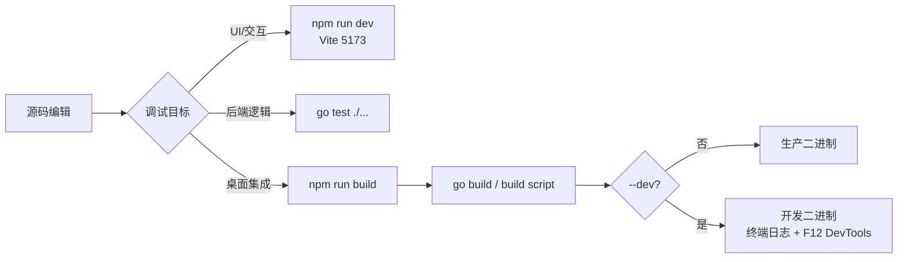
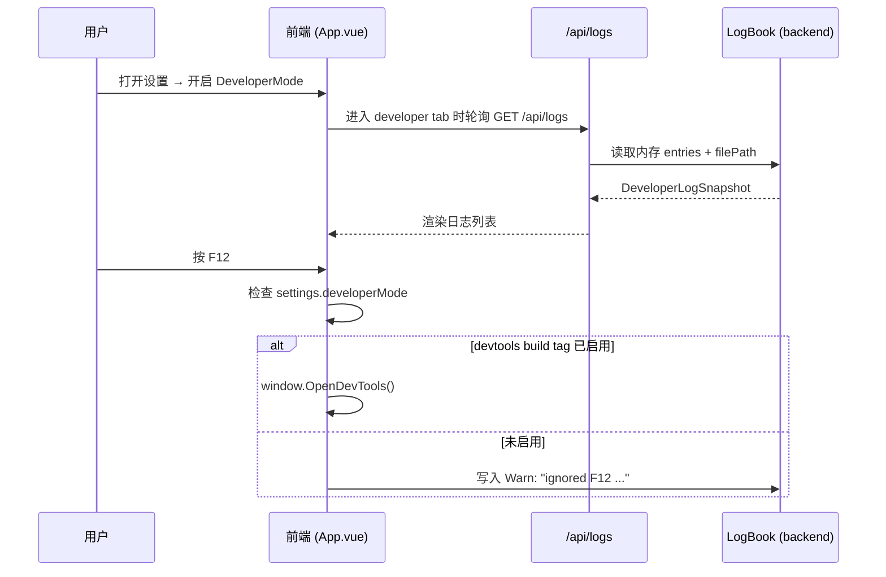

InvestGo 的调试体系围绕**双模式开关**（编译期 `--dev` 与运行时 `developerMode`）和**统一结构化日志**（前后端日志聚合、内存环形缓冲、自动脱敏）展开。本文档面向中级开发者，系统讲解从本地前端热更新、桌面端 DevTools 唤出，到日志定位与常见问题速查的完整调试链路。

---

## 开发工作流概览

InvestGo 不是 monorepo，Go 模块根即仓库根，前端代码位于 `frontend/` 目录。根据调试目标的不同，本地开发有三种典型工作流：

1. **纯前端开发**：运行 `npm run dev` 启动 Vite 开发服务器（端口 `5173`）。此时页面在浏览器中运行，**不存在 Wails 桌面运行时**，因此所有调用 `window.runtime` 或 `window._wails` 的代码必须做空值保护。这是验证 UI 布局、主题切换、组件交互的最快方式。
2. **Go 后端验证**：执行 `env GOCACHE=/tmp/go-build-cache go test ./...` 运行单元测试；或直接 `go run .` 启动完整的 Wails 桌面应用（需先执行 `npm run build` 生成 `frontend/dist` 静态资源）。
3. **完整桌面构建**：通过平台构建脚本（`scripts/build-darwin-aarch64.sh` 等）产出可执行二进制，用于验证窗口 chrome、原生菜单、DevTools、打包产物等行为。

以下 Mermaid 流程图展示了从源码到可调试产物的关键路径：



Sources: [CLAUDE.md](CLAUDE.md#L29-L42), [README.md](README.md#L81-L95), [vite.config.ts](vite.config.ts#L1-L16)

---

## 开发构建与生产构建的差异

InvestGo 的构建脚本通过 **Go linker flags** 和 **build tags** 在编译期注入开发特性。以 macOS 构建脚本为例，`--dev` 参数会同时修改 `LDFLAGS` 与 `BUILD_TAGS`：

| 构建维度 | 生产构建（默认） | 开发构建（`--dev` / `-Dev`） |
|---|---|---|
| 版本注入 | `-X main.appVersion=$APP_VERSION` | 同上 |
| 终端日志 | 关闭（`defaultTerminalLogging=0`） | 开启（`-X main.defaultTerminalLogging=1`） |
| DevTools 支持 | 关闭（`defaultDevToolsBuild=0`） | 开启（`-X main.defaultDevToolsBuild=1`） |
| Go build tags | `production` | `production devtools` |
| F12 有效性 | 按下 F12 时提示未启用 devtools 构建 | 按下 F12 可打开 Web Inspector |

在 `main.go` 中，`terminalLoggingEnabled()` 函数除了读取 linker-injected 的默认值外，还会扫描进程参数：只要命令行包含 `-dev` 或 `--dev`，即使未经开发构建也能开启终端日志输出。这一设计方便开发者在 `go run . --dev` 时直接查看后端日志，而无需重新编译。

Windows 与 macOS 的构建脚本行为完全一致。PowerShell 脚本通过 `-Dev` switch 触发相同的 linker flags 与 tags，保证跨平台调试体验统一。

Sources: [scripts/build-darwin-aarch64.sh](scripts/build-darwin-aarch64.sh#L1-L66), [scripts/build-windows-amd64.ps1](scripts/build-windows-amd64.ps1#L1-L88), [main.go](main.go#L97-L130)

---

## 应用内开发者模式与 DevTools

InvestGo 的运行时开发者能力由 `AppSettings.DeveloperMode` 布尔字段控制。该字段持久化在 `state.json` 中，用户可在「设置 → 开发者」标签页开启。开发者模式本身不直接输出日志，而是作为**功能总开关**，决定以下行为是否可用：

1. **F12 Web Inspector**：仅在 `developerMode == true` **且** 二进制编译时启用了 `devtools` build tag 时，`F12` 快捷键才会调用 `window.OpenDevTools()`。若任一条件不满足，按键事件会被静默忽略，并向日志写入一条 Warn 级别提示。
2. **开发者日志面板**：设置页中的「开发者」标签页仅在 `developerMode == true` 时展示日志列表、刷新/复制/清空按钮及日志文件路径。



Sources: [main.go](main.go#L132-L156), [frontend/src/components/modules/SettingsModule.vue](frontend/src/components/modules/SettingsModule.vue#L1-L370), [internal/core/model.go](internal/core/model.go#L97-L121)

---

## 结构化日志体系

InvestGo 实现了一套前后端统一的日志架构，核心由 `internal/logger/logBook.go` 与 `frontend/src/devlog.ts` 组成。

### 后端 LogBook

`LogBook` 是线程安全的环形日志缓冲区，默认容量 **400 条**。每条日志包含 `source`（如 `backend`、`system`）、`scope`（如 `app`、`proxy`）、`level`（`debug`/`info`/`warn`/`error`）、`message` 和 `timestamp`。日志会同时写入三处：

- **内存**：固定长度循环覆盖，避免无界增长；
- **文件**：默认路径为 `os.UserConfigDir()/investgo/logs/app.log`（macOS 下即 `~/Library/Application Support/investgo/logs/app.log`）；
- **终端**：仅在 `terminalLoggingEnabled()` 返回 true 时输出到 `os.Stderr`。

`LogBook` 还提供了 `Writer()` 与 `NewSlogLogger()` 两个适配器，分别桥接标准库的 `io.Writer` 接口和 Go 1.21+ 的 `slog.Handler` 接口，使第三方库（如 Wails v3 的 `application.Options.Logger`）能够无缝接入同一套日志后端。

Sources: [internal/logger/logger.go](internal/logger/logger.go#L1-L300)

### 前端客户端日志捕获

`devlog.ts` 在应用挂载时通过 `installClientLogCapture()` 劫持原生 `console.*` 方法，将所有 `debug`/`info`/`warn`/`error` 调用转换为结构化日志条目，存入前端响应式数组 `clientLogs`（容量上限 **200 条**）。同时，它监听 `window.error` 与 `unhandledrejection` 事件，捕获未处理的运行时异常。

前端日志不会立即逐条发送到后端，而是通过 **1 秒批量队列** (`mirrorQueue`) 合并后，以 `keepalive` fetch 请求投递到 `POST /api/client-logs`。这样既能降低网络开销，也能在页面卸载时尽可能完成日志上报。

### 敏感信息脱敏

前后端日志系统均内建了 API Key 脱敏规则。`devlog.ts` 中的 `redactSensitiveText()` 会匹配以下模式并将值替换为 `***`：

- 配置字段：`alphaVantageApiKey`、`twelveDataApiKey`、`finnhubApiKey`、`polygonApiKey` 的键值对；
- URL 查询参数：`apikey`、`api_key`、`key` 等。

这保证了开发者在复制日志粘贴到 Issue 或即时通讯工具时不会意外泄露付费 API 密钥。

Sources: [frontend/src/devlog.ts](frontend/src/devlog.ts#L1-L130), [frontend/src/api.ts](frontend/src/api.ts#L1-L75)

### 统一日志面板

`useDeveloperLogs.ts` composable 将后端日志（通过 `/api/logs?limit=160` 获取）与前端 `clientLogs` 合并，按时间戳降序排列后截取前 **250 条**，供给「设置 → 开发者」标签页展示。当用户停留在该标签页时，`App.vue` 会启动 **4 秒轮询** (`developerLogTimer`)，实时拉取后端新日志；离开标签页后自动停止轮询，避免后台无意义请求。

日志面板支持三种操作：

| 操作 | 行为 | 对应 API |
|---|---|---|
| 刷新 | 立即拉取后端最新日志 | `GET /api/logs?limit=160` |
| 复制 | 将合并后的日志转为纯文本写入剪贴板 | 纯前端 |
| 清空 | 清空后端内存与文件日志，同时清空前端 `clientLogs` | `DELETE /api/logs` |

Sources: [frontend/src/composables/useDeveloperLogs.ts](frontend/src/composables/useDeveloperLogs.ts#L1-L85), [frontend/src/App.vue](frontend/src/App.vue#L1-L230)

---

## API 请求调试与错误定位

前端所有后端通信都经过 `frontend/src/api.ts` 中的 `api<T>()` 包装器。该包装器内建以下调试友好特性：

- **超时与取消**：默认 15 秒超时，通过 `AbortController` 实现；支持传入外部 `signal` 实现联动取消。
- **错误透传**：当后端返回 `4xx/5xx` 时，响应体中的 `debugError` 字段（原始技术错误）会与 `error` 字段（本地化用户错误）一并被捕获。`api()` 会将脱敏后的 `METHOD path -> debugMessage` 写入客户端日志。
- **请求头标记**：每个请求自动携带 `X-InvestGo-Locale`，确保后端返回的错误消息与当前前端语言一致。

在调试网络层问题时，打开「设置 → 开发者」日志面板即可直接看到 API 失败的原始路径与错误信息，无需额外打开浏览器 Network 面板。

Sources: [frontend/src/api.ts](frontend/src/api.ts#L1-L75)

---

## 常见问题速查

以下症状与排查路径基于项目调试手册 (`debugging-playbook.md`)，聚焦于开发模式下最常遇到的阻塞点：

| 症状 | 最可能原因 | 排查路径 |
|---|---|---|
| 页面空白或数据陈旧 | `frontend/dist` 未在 Go 构建前重新生成 | 确认已执行 `npm run build`；检查嵌入路径 `//go:embed frontend/dist` |
| F12 无法打开 DevTools | 未开启 `developerMode` 或未使用 `--dev` 构建 | 检查设置页开关 + 构建命令是否带 `--dev` |
| 日志面板为空 | 未开启 `developerMode` 或 `LogBook` 未初始化 | 确认设置页开关；检查 `/api/logs` 响应 |
| 构建失败且提示找不到工具 | 平台工具链缺失 | macOS 需 `swift/sips/iconutil/hdiutil/ditto`；Windows 需 WebView2 Runtime |
| 行情或历史数据缺失 | Provider 层网络/参数问题 | 先查看日志中 `backend/proxy` 与 `backend/quote` 记录，再检查 provider 实现 |
| 复制日志时泄露 API Key | 脱敏正则未命中 | 检查 `devlog.ts` 中的 `redactSensitiveText` 与具体日志格式是否匹配 |

Sources: [.agents/skills/investgo-debugging/references/debugging-playbook.md](.agents/skills/investgo-debugging/references/debugging-playbook.md#L1-L50)

---

## 日志文件路径与清理

开发期间如需直接查看文本日志或手动清理，可参考以下默认路径：

| 平台 | 状态文件 | 日志文件 |
|---|---|---|
| macOS | `~/Library/Application Support/investgo/state.json` | `~/Library/Application Support/investgo/logs/app.log` |
| Windows | `%AppData%\investgo\state.json` | `%AppData%\investgo\logs\app.log` |
| 降级路径（无法获取 UserConfigDir 时） | `./data/state.json` | `./data/logs/app.log` |

`LogBook.Clear()` 会同时清空内存环形缓冲区并将日志文件截断为 0 字节。该操作由「设置 → 开发者 → 清空」按钮触发。

Sources: [main.go](main.go#L158-L180)

---

## 快速验证命令清单

在修改代码后，使用最小命令集验证对应层级：

```bash
# 1. 前端类型检查与构建
npm run typecheck
npm run build

# 2. Go 测试
env GOCACHE=/tmp/go-build-cache go test ./...

# 3. 开发模式运行桌面应用（终端日志 + 前端 dist 已嵌入）
go run . --dev

# 4. macOS 开发构建（支持 F12 DevTools）
./scripts/build-darwin-aarch64.sh --dev

# 5. Windows 开发构建
.\scripts\build-windows-amd64.ps1 -Dev
```

Sources: [AGENTS.md](AGENTS.md#L1-L30)

---

## 下一步阅读建议

- 若需深入理解构建脚本中的版本注入与跨平台差异，请参阅 [跨平台构建脚本与版本注入](28-kua-ping-tai-gou-jian-jiao-ben-yu-ban-ben-zhu-ru)。
- 若需了解后端日志的完整数据结构及其与 `slog` 的桥接细节，请参阅 [结构化日志体系](13-jie-gou-hua-ri-zhi-ti-xi)。
- 若需了解 Wails v3 窗口初始化、平台代理与 panic 处理机制，请参阅 [应用入口与 Wails v3 集成](4-ying-yong-ru-kou-yu-wails-v3-ji-cheng)。