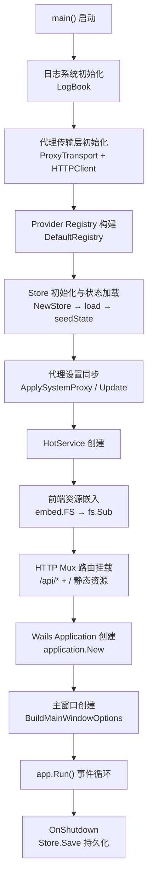
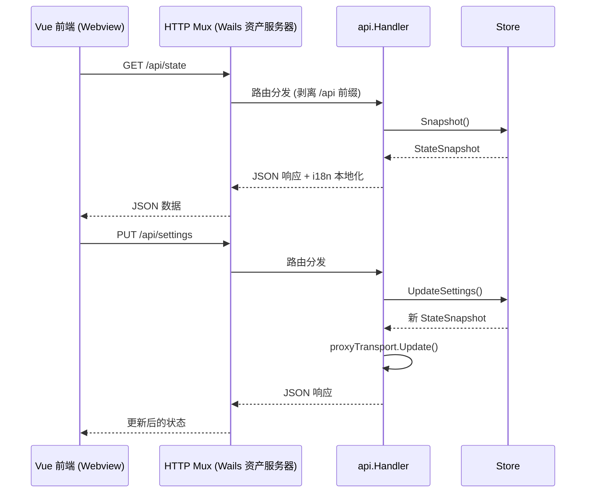
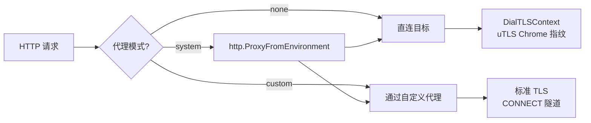
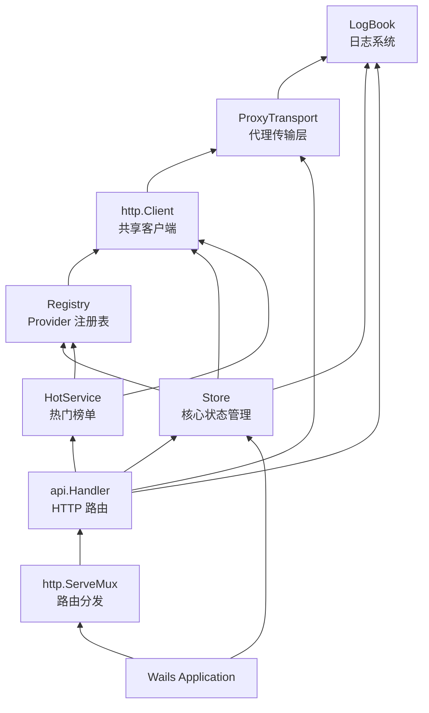

InvestGo 是一款基于 **Go + Wails v3** 构建的桌面投资监控应用。本文深入解析 `main.go` 作为 Wails 组合根（Composition Root）的启动编排逻辑——从前端资源嵌入、HTTP 路由挂载、Store 初始化链路，到窗口配置与生命周期钩子，完整揭示 Go 后端与 Wails 桌面运行时的集成机制。

## 架构全景

Wails v3 的核心设计理念是将 Go 后端与 Web 前端统一嵌入同一个桌面进程中。前端以静态资源方式被编译进二进制文件，后端通过标准 `http.Handler` 为前端提供 API，Wails 运行时负责窗口管理、原生桥接和生命周期调度。下面这张图呈现了从进程启动到窗口渲染的完整数据流：



Sources: [main.go](main.go#L38-L149)

## 启动序列详解

`main()` 函数是整个应用的入口点，它按照严格的顺序依次初始化各个子系统。这个顺序至关重要——每个步骤都依赖前一步的产物，交换顺序可能导致空指针或功能异常。

### 第一阶段：日志与开发模式检测

```go
logs := logger.NewLogBook(400)
if terminalLoggingEnabled() {
    logs.EnableConsole(os.Stderr)
}
```

应用启动时首先创建一个容量为 400 条的内存日志簿 `LogBook`，它同时支持内存环形缓冲、文件持久化和终端输出三种通道。终端输出仅在开发模式下启用，由两个条件控制：构建时通过 `-ldflags` 注入的 `defaultTerminalLogging` 变量，或运行时传入的 `-dev` / `--dev` 命令行参数。日志文件路径默认为 `$HOME/Library/Application Support/investgo/logs/app.log`（macOS），通过 `os.UserConfigDir()` 跨平台解析。

Sources: [main.go](main.go#L38-L48), [main.go](main.go#L151-L183), [internal/logger/logger.go](internal/logger/logger.go#L40-L61)

### 第二阶段：网络传输层与 Provider 注册

```go
proxyTransport := platform.NewProxyTransport("system", "")
httpClient := platform.NewHTTPClient(proxyTransport)
```

**ProxyTransport** 是全局共享的 HTTP 传输层，它封装了动态代理切换和 uTLS Chrome 指纹伪装两大能力。初始化时默认使用 `"system"` 代理模式，在 Store 尚未加载持久化设置之前，系统代理检测尚未执行，此时 `http.ProxyFromEnvironment` 会读取环境变量中的代理配置。

**Provider Registry** 通过 `marketdata.DefaultRegistry` 一次性注册所有行情数据源（东方财富、新浪、Yahoo Finance 等），每个 Provider 共享同一个 `httpClient`，确保代理设置对全部数据请求生效。

Sources: [main.go](main.go#L55-L59), [internal/platform/proxy_transport.go](internal/platform/proxy_transport.go#L22-L65)

### 第三阶段：Store 初始化与设置回调

Store 的创建是启动链中最复杂的环节。它需要完成磁盘状态加载、数据规范化、汇率后台预热等多项工作：

```go
store, err := store.NewStore(
    defaultStatePath(),              // 状态文件路径
    registry.QuoteProviders(),        // 行情 Provider 映射
    registry.QuoteSourceOptions(),    // UI 可选数据源列表
    registry.NewHistoryRouter(...),   // 历史数据路由器
    logs,                             // 日志簿
    appVersion,                       // 构建注入的版本号
    httpClient,                       // 共享 HTTP 客户端
)
settingsFunc = store.CurrentSettings  // 连接真实设置回调
```

一个关键的**延迟绑定**模式值得注意：`settingsFunc` 最初返回空 `AppSettings{}`，在 Store 初始化完成后才被替换为 `store.CurrentSettings`。这是因为 Registry 创建在 Store 之前，但 Registry 内部的 Provider 需要在运行时读取最新的用户设置（如 API Key、数据源偏好），通过函数回调而非直接引用实现了解耦。

Sources: [main.go](main.go#L58-L76), [internal/core/store/store.go](internal/core/store/store.go#L50-L101)

### 第四阶段：代理设置同步

Store 加载完毕后，持久化的代理设置被同步到传输层：

```go
snapshot := store.Snapshot()
proxyMode := snapshot.Settings.ProxyMode
if proxyMode == "system" {
    platform.ApplySystemProxy(logs)   // macOS: scutil --proxy → 环境变量
}
proxyTransport.Update(proxyMode, proxyURL)
```

`ApplySystemProxy` 仅在 macOS 上执行，通过调用 `scutil --proxy` 读取系统代理配置并注入到 `HTTPS_PROXY` / `HTTP_PROXY` 环境变量。这意味着代理配置的生效路径是：**macOS 系统设置 → scutil 读取 → 环境变量注入 → `http.ProxyFromEnvironment` → ProxyTransport.proxyFunc**。

Sources: [main.go](main.go#L80-L89), [internal/platform/proxy.go](internal/platform/proxy.go#L18-L63)

### 第五阶段：HTTP 路由挂载与 Wails 应用创建

前端资源和 API 路由通过标准 `http.ServeMux` 统一挂载：

```go
mux := http.NewServeMux()
mux.Handle("/api/", api.NewHandler(store, hotService, logs, proxyTransport))
mux.Handle("/", application.BundledAssetFileServer(frontendFS))
```

**`/api/`** 前缀路由将请求分发给 `api.Handler`，它内部再剥离 `/api` 前缀，路由到具体的 RESTful 端点。**`/`** 根路径由 Wails 提供的 `BundledAssetFileServer` 处理，它负责从嵌入的 `frontend/dist` 中提供编译后的 Vue SPA 静态资源。这种设计使得前后端完全运行在同一个 HTTP 服务器中，不存在跨域问题。

Sources: [main.go](main.go#L93-L100), [internal/api/http.go](internal/api/http.go#L57-L99)

### 第六阶段：Wails 应用配置与窗口创建

```go
app := application.New(application.Options{
    Name:        "InvestGo",
    Description: "Go + Wails v3 Investment Monitor Desktop App",
    Icon:        appIcon,
    Assets: application.AssetOptions{
        Handler:        mux,
        DisableLogging: true,
    },
    Mac: application.MacOptions{
        ApplicationShouldTerminateAfterLastWindowClosed: true,
    },
    PanicHandler: func(details *application.PanicDetails) { ... },
    OnShutdown:   func() { store.Save() },
})
```

Wails 应用的关键配置项如下表所示：

| 配置项 | 作用 | 备注 |
|--------|------|------|
| `Assets.Handler` | 统一 HTTP 路由入口 | 同时服务 API 和前端静态资源 |
| `Assets.DisableLogging` | 禁用 Wails 内部资源请求日志 | 减少生产环境噪声 |
| `Mac.ApplicationShouldTerminateAfterLastWindowClosed` | 最后窗口关闭即退出应用 | macOS 原生行为 |
| `PanicHandler` | 全局 panic 捕获 | 写入 LogBook 而非直接崩溃 |
| `OnShutdown` | 应用关闭回调 | 确保持久化状态写入磁盘 |

Sources: [main.go](main.go#L102-L148)

## 前端资源嵌入机制

Wails v3 使用 Go 的 `embed` 包将编译后的前端资源直接嵌入到二进制文件中，消除运行时对外部文件系统的依赖：

```go
//go:embed frontend/dist
var frontendAssets embed.FS

//go:embed build/appicon.png
var appIcon []byte
```

嵌入后通过 `fs.Sub(frontendAssets, "frontend/dist")` 将虚拟文件系统根目录重映射到 `dist` 子目录，使得 `index.html` 可以直接从 `/` 路径访问。应用图标 `appIcon` 作为原始字节嵌入，传递给 Wails 用于设置窗口和任务栏图标。

**构建顺序约束**：Go 编译时 `frontend/dist` 目录必须已存在且包含 Vite 构建产物。构建脚本中 `npm run build` 先于 `go build` 执行，确保嵌入资源是最新的。

Sources: [main.go](main.go#L28-L37), [main.go](main.go#L93-L96), [scripts/build-darwin-aarch64.sh](scripts/build-darwin-aarch64.sh#L57-L58)

## 窗口配置与平台适配

窗口配置由 `internal/platform/window.go` 集中管理，核心函数 `BuildMainWindowOptions` 根据用户设置和操作系统返回不同的窗口行为：

| 配置维度 | 默认值 | 说明 |
|----------|--------|------|
| 窗口尺寸 | 1200 × 828 | 最小尺寸也设为相同值，避免布局错乱 |
| 背景色 | `RGB(247, 243, 233)` | 暖白色，与前端加载时的占位背景一致 |
| Windows 主题 | `SystemDefault` | 跟随系统明暗模式 |
| macOS 背景材质 | `MacBackdropTranslucent` | 毛玻璃半透明效果 |
| 标题栏行为 | 由 `UseNativeTitleBar` 设置决定 | 见下方详细说明 |

### 标题栏策略

**macOS** 下使用 `MacTitleBarHiddenInsetUnified`——隐藏标题栏但保留红绿黄交通灯按钮，内容区延伸到标题栏区域，实现沉浸式布局。**Windows/Linux** 下使用 `Frameless = true`——完全无框窗口，依赖前端自定义窗口控件（最小化、最大化、关闭按钮）。

标题栏模式通过 Store 设置 `UseNativeTitleBar` 在运行时动态决定，前端通过 `wails-runtime.ts` 的 `shouldShowCustomWindowControls()` 和 `shouldReserveMacWindowControls()` 判断是否渲染自定义控件。

Sources: [internal/platform/window.go](internal/platform/window.go#L1-L41), [frontend/src/wails-runtime.ts](frontend/src/wails-runtime.ts#L72-L79)

### DevTools 与 F12 快捷键

开发者工具的打开受双重条件保护：

1. **运行时开关**：`snapshot.Settings.DeveloperMode` 必须为 `true`
2. **构建时开关**：`defaultDevToolsBuild` 必须为 `"1"`（通过 `-ldflags` 注入）

两个条件同时满足时，按 F12 才会调用 `window.OpenDevTools()`。构建脚本中 `--dev` 参数控制此标志：

```bash
# 生产构建：F12 不可用
./scripts/build-darwin-aarch64.sh

# 开发构建：F12 可用（需同时开启 DeveloperMode 设置）
./scripts/build-darwin-aarch64.sh --dev
```

Sources: [main.go](main.go#L127-L141), [main.go](main.go#L186-L188), [scripts/build-darwin-aarch64.sh](scripts/build-darwin-aarch64.sh#L68-L73)

## 前后端通信桥接

InvestGo 前后端通信采用**纯 HTTP API** 模式，而非 Wails v2 风格的 Go 函数绑定。所有数据交互通过内嵌 HTTP 服务器完成，前端使用标准 `fetch` API 发起请求。



这种架构的优势在于：前端可以在标准浏览器中通过 Vite 开发服务器独立运行（API 请求会失败但不会崩溃），而 `wails-runtime.ts` 中的窗口操作方法（最大化、最小化、拖拽等）在浏览器环境下会安全地降级为空操作。

Sources: [internal/api/http.go](internal/api/http.go#L44-L99), [frontend/src/api.ts](frontend/src/api.ts#L31-L86), [frontend/src/wails-runtime.ts](frontend/src/wails-runtime.ts#L16-L22)

### Wails 运行时桥接

前端通过两种方式与 Wails 运行时交互：

| 交互方式 | 用途 | 浏览器降级 |
|----------|------|------------|
| `window.runtime` 全局对象 | 窗口控制（最大化、关闭等） | 返回 `null`，操作静默跳过 |
| `window._wails` 全局对象 | 平台环境检测、窗口方法调用 | 返回 `null`，降级为浏览器模式 |
| `/wails/runtime` POST 端点 | Wails v3 新式窗口方法调用 | 请求失败，catch 处理 |
| `_wails.invoke("wails:drag")` | 触发原生窗口拖拽 | 无操作 |

`getDesktopPlatform()` 函数通过 `_wails.environment.OS` 检测操作系统，返回 `"darwin"` | `"windows"` | `"linux"` | `"browser"` | `"unknown"`，驱动前端的平台条件渲染。

Sources: [frontend/src/wails-runtime.ts](frontend/src/wails-runtime.ts#L1-L141)

## 构建时变量注入

Go 的 `-ldflags` 机制在编译时向 `main` 包的变量注入具体值，控制生产与开发构建的行为差异：

| 变量 | 默认值 | 注入方式 | 作用 |
|------|--------|----------|------|
| `appVersion` | `"dev"` | `-X main.appVersion=$APP_VERSION` | 版本号显示在 UI 和日志中 |
| `defaultTerminalLogging` | `"0"` | `-X main.defaultTerminalLogging=1` | 是否输出日志到终端 |
| `defaultDevToolsBuild` | `"0"` | `-X main.defaultDevToolsBuild=1` | 是否启用 F12 DevTools |

构建脚本在 `--dev` 模式下同时注入后两个变量并添加 `devtools` 构建标签：

```bash
LDFLAGS="-s -w -X main.appVersion=$APP_VERSION"
BUILD_TAGS="production"
if [[ "$DEV_BUILD" == "1" ]]; then
    LDFLAGS="$LDFLAGS -X main.defaultTerminalLogging=1 -X main.defaultDevToolsBuild=1"
    BUILD_TAGS="production devtools"
fi
go build -tags "$BUILD_TAGS" -trimpath -ldflags="$LDFLAGS" -o "$OUTPUT_FILE" .
```

Sources: [main.go](main.go#L24-L26), [scripts/build-darwin-aarch64.sh](scripts/build-darwin-aarch64.sh#L68-L75)

## 应用生命周期与安全退出

Wails 应用的生命周期由 `application.New` → `app.Window.NewWithOptions` → `app.Run()` 三个阶段构成。`OnShutdown` 回调在窗口关闭后触发，负责将 Store 中的内存状态持久化到磁盘：

```go
OnShutdown: func() {
    logs.Info("backend", "app", "shutdown requested")
    if err := store.Save(); err != nil {
        logs.Error("backend", "storage", fmt.Sprintf("save state on shutdown failed: %v", err))
    }
},
```

`PanicHandler` 则作为全局异常安全网，将 panic 的错误信息和堆栈记录到 LogBook，避免桌面应用静默崩溃而无日志可查。`defer` 语句确保日志文件在退出前正确关闭。

状态文件默认存储路径通过 `os.UserConfigDir()` 跨平台解析：

| 平台 | 状态文件路径 | 日志文件路径 |
|------|------------|------------|
| macOS | `~/Library/Application Support/investgo/state.json` | `~/Library/Application Support/investgo/logs/app.log` |
| Linux | `~/.config/investgo/state.json` | `~/.config/investgo/logs/app.log` |
| Windows | `%AppData%/investgo/state.json` | `%AppData%/investgo/logs/app.log` |
| 降级 | `./data/state.json` | `./data/logs/app.log` |

Sources: [main.go](main.go#L114-L122), [main.go](main.go#L151-L168)

## ProxyTransport 与 TLS 指纹伪装

`ProxyTransport` 不仅处理代理路由，还集成了 **uTLS Chrome 指纹伪装**。这是为了应对部分金融数据源（如东方财富、新浪）的 TLS 客户端指纹检测（JA3/JA4），避免 Go 默认的 TLS ClientHello 被识别为非浏览器流量而导致连接重置。



关键设计细节：当使用自定义代理时，Go 标准库会通过 CONNECT 隧道建立连接，此时 TLS 握手由内置的 HTTP/2 协商完成，`DialTLSContext` 不被调用。只有在直连场景下，uTLS 才接管 TLS 握手，伪装为 Chrome 浏览器。同时，`DialTLSContext` 中强制将 ALPN 设置为 `http/1.1`，因为 Go 的 `http.Transport` 配合自定义 `DialTLSContext` 只支持 HTTP/1.x，协商 h2 会导致协议帧解析错误。

Sources: [internal/platform/proxy_transport.go](internal/platform/proxy_transport.go#L22-L157)

## 启动依赖关系图

下面这张图总结了 `main()` 中各组件之间的依赖关系，箭头方向表示"被依赖"：



Sources: [main.go](main.go#L38-L149)

## 延伸阅读

- 了解 API 路由的具体端点定义与请求处理流程，参阅 [HTTP API 路由与请求处理](5-http-api-lu-you-yu-qing-qiu-chu-li)
- 深入 Store 的状态管理与持久化机制，参阅 [Store 核心状态管理与持久化](6-store-he-xin-zhuang-tai-guan-li-yu-chi-jiu-hua)
- 理解代理检测的系统级实现细节，参阅 [代理检测与传输层管理](11-dai-li-jian-ce-yu-chuan-shu-ceng-guan-li)
- 前端如何与 Wails 运行时桥接，参阅 [Wails 运行时桥接与平台适配](16-wails-yun-xing-shi-qiao-jie-yu-ping-tai-gua-pei)
- 跨平台构建脚本如何注入版本与构建标志，参阅 [跨平台构建脚本与版本注入](28-kua-ping-tai-gou-jian-jiao-ben-yu-ban-ben-zhu-ru)