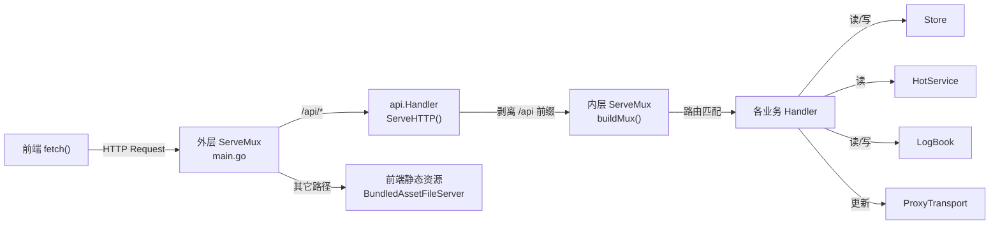
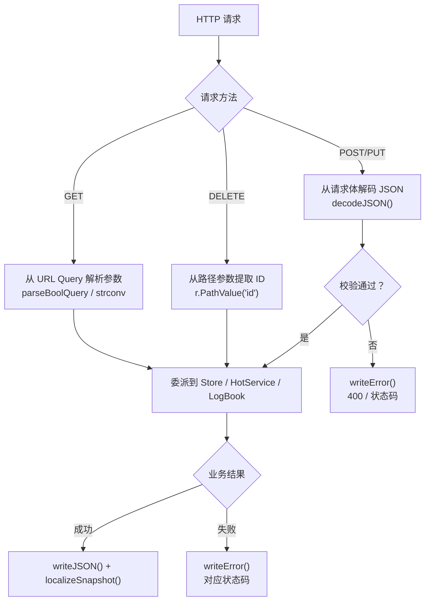

InvestGo 的后端以 Go 标准库 `net/http` 为基础，构建了一套轻量但完备的 RESTful API 层，作为 Wails v3 桌面应用中前端与核心业务状态之间的唯一通信桥梁。本页将深入剖析 **路由注册策略、请求生命周期、统一错误处理与国际化响应** 三大核心机制，帮助你理解从前端 `fetch` 到后端 Store 状态变更的完整链路。

Sources: [http.go](internal/api/http.go#L1-L15), [main.go](main.go#L98-L100)

## 架构定位：双层 ServeMux 与职责分层

InvestGo 的 HTTP 服务并非独立运行的服务器，而是作为 Wails v3 应用的 `AssetOptions.Handler` 注册到应用生命周期中。在 [main.go](main.go#L98-L100) 中，一个外层 `http.ServeMux` 将 `/api/` 前缀路由到 `api.Handler`，其余路径回退到前端静态资源服务：

```go
mux := http.NewServeMux()
mux.Handle("/api/", api.NewHandler(store, hotService, logs, proxyTransport))
mux.Handle("/", application.BundledAssetFileServer(frontendFS))
```

`api.Handler` 内部维护第二个 `http.ServeMux`（内层 mux），利用 **Go 1.22+ 的方法与路径参数匹配**（如 `GET /items/{id}`）完成细粒度路由分发。`ServeHTTP` 方法在委派前执行 `/api` 前缀剥离，使内层路由模式保持简洁的相对路径风格。



这种双层 mux 设计的关键收益在于：**路由定义与挂载点解耦**——`api` 包不需要知道自己在主 mux 上的挂载路径，只需在 `buildMux()` 中声明相对路由，而前缀管理完全由 `main.go` 控制。

Sources: [main.go](main.go#L98-L100), [http.go](internal/api/http.go#L56-L99)

## Handler 依赖注入与构造

`Handler` 结构体通过构造函数 `NewHandler` 接收四个核心依赖，遵循显式依赖注入原则，不依赖全局变量或服务定位器：

| 字段 | 类型 | 职责 |
|---|---|---|
| `store` | `*store.Store` | 核心状态管理——持仓列表、价格提醒、设置项、刷新、历史行情 |
| `hot` | `*hot.HotService` | 热门榜单数据服务，按分类/排序/关键词查询 |
| `logs` | `*logger.LogBook` | 开发者日志——读取、清除、前端日志写入 |
| `proxyTransport` | `*platform.ProxyTransport` | 代理传输层——设置变更时同步更新代理配置 |

构造时立即调用 `buildMux()` 注册所有路由，返回的 `Handler` 实例同时实现了 `http.Handler` 接口，可直接作为 `mux.Handle` 的目标。

Sources: [http.go](internal/api/http.go#L18-L54)

## 完整路由表

`buildMux()` 方法集中注册了全部 16 条业务路由和 1 条兜底 404 路由。下表按领域分组，列出方法、路径模式、对应 handler 及核心行为：

### 状态与配置

| 方法 | 路径 | Handler | 说明 |
|---|---|---|---|
| `GET` | `/state` | `handleState` | 返回完整应用状态快照（`StateSnapshot`），前端主循环的核心数据源 |
| `PUT` | `/settings` | `handleUpdateSettings` | 更新应用设置，同步刷新 `ProxyTransport`，返回更新后的快照 |

### 行情刷新

| 方法 | 路径 | Handler | 说明 |
|---|---|---|---|
| `POST` | `/refresh` | `handleRefresh` | 触发全量行情刷新，支持 `?force=true` 跳过缓存 |
| `POST` | `/items/{id}/refresh` | `handleRefreshItem` | 刷新指定标的行情，路径参数 `{id}` 通过 `r.PathValue("id")` 获取 |
| `GET` | `/history` | `handleHistory` | 获取指定标的的历史 K 线数据，参数 `itemId`/`interval`/`force` 通过 query 传递 |
| `GET` | `/overview` | `handleOverview` | 获取组合概览分析数据，支持 `?force=true` 强制刷新 |

### 持仓管理

| 方法 | 路径 | Handler | 说明 |
|---|---|---|---|
| `POST` | `/items` | `handleCreateItem` | 创建新标的，请求体为 `WatchlistItem` JSON |
| `PUT` | `/items/{id}` | `handleUpdateItem` | 更新标的，路径参数 `{id}` 覆盖请求体中的 ID |
| `PUT` | `/items/{id}/pin` | `handlePinItem` | 置顶/取消置顶，请求体为 `{"pinned": true/false}` |
| `DELETE` | `/items/{id}` | `handleDeleteItem` | 删除标的 |

### 价格提醒

| 方法 | 路径 | Handler | 说明 |
|---|---|---|---|
| `POST` | `/alerts` | `handleCreateAlert` | 创建价格提醒，请求体为 `AlertRule` JSON |
| `PUT` | `/alerts/{id}` | `handleUpdateAlert` | 更新提醒，路径参数覆盖请求体 ID |
| `DELETE` | `/alerts/{id}` | `handleDeleteAlert` | 删除提醒 |

### 热门榜单

| 方法 | 路径 | Handler | 说明 |
|---|---|---|---|
| `GET` | `/hot` | `handleHot` | 查询热门榜单，参数 `category`/`sort`/`q`/`page`/`pageSize`/`force` 通过 query 传递 |

### 日志与外部链接

| 方法 | 路径 | Handler | 说明 |
|---|---|---|---|
| `GET` | `/logs` | `handleLogs` | 获取开发者日志，支持 `?limit=N` 限制条数 |
| `DELETE` | `/logs` | `handleClearLogs` | 清空持久化日志 |
| `POST` | `/client-logs` | `handleClientLogs` | 接收前端上报的开发者日志 |
| `POST` | `/open-external` | `handleOpenExternal` | 使用系统默认浏览器打开外部链接 |

### 兜底路由

| 方法 | 路径 | Handler | 说明 |
|---|---|---|---|
| `ANY` | `/{path...}` | 匿名函数 | 返回 JSON 格式 404，`errNotFound` 包含未匹配的路径 |

> **注意**：以上路径均为**内层 mux 的相对路径**。前端实际请求时需加上 `/api` 前缀，例如 `GET /api/state`。

Sources: [http.go](internal/api/http.go#L58-L86)

## 请求处理统一模式

所有 handler 遵循一套高度一致的 **解码 → 委派 → 响应** 三段式模式，不同 HTTP 方法的差异仅在"解码"阶段体现：



**GET 请求**的参数从 URL Query String 提取，例如 `handleHot` 从 `request.URL.Query()` 读取 `category`、`sort`、`q`、`page`、`pageSize`、`force` 等参数。**POST/PUT 请求**使用 `decodeJSON()` 统一反序列化请求体，该方法会自动关闭 `request.Body` 并在 JSON 格式错误时返回 `apiError`。**DELETE 请求**和需要路径参数的请求使用 Go 1.22+ 的 `r.PathValue("id")` 提取路径段。

Sources: [handler.go](internal/api/handler.go#L1-L53), [http.go](internal/api/http.go#L110-L123)

### 通用查询参数解析

多个 handler 共享 `parseBoolQuery` 工具函数，将字符串查询参数宽松解析为布尔值——接受 `1`、`true`、`yes`、`y`、`on`（不区分大小写）为真值，其余均为假。这为 `force` 等开关参数提供了灵活的传值方式。

Sources: [handler.go](internal/api/handler.go#L46-L53)

### 外部链接安全校验

`handleOpenExternal` 是唯一引入独立输入校验逻辑的 handler。`sanitiseExternalURL` 函数执行三重校验：URL 非空、协议限定为 `http`/`https`、主机名必须存在。校验通过后调用平台特定的命令（macOS: `open`、Windows: `rundll32`、Linux: `xdg-open`）在默认浏览器中打开链接，通过 `command.Start()` 异步执行不阻塞响应。

Sources: [http.go](internal/api/http.go#L155-L174), [open_external.go](internal/api/open_external.go#L10-L26)

## 错误处理与国际化响应

### 统一错误格式

所有 API 错误通过 `writeError()` 输出为标准 JSON 结构：

```json
{
  "error": "标的已在列表中: AAPL",
  "debugError": "Item already exists in the list: AAPL"
}
```

- **`error`**：经过 `i18n.LocalizeErrorMessage` 本地化后的用户友好消息
- **`debugError`**：仅当本地化消息与原始英文消息不同时才出现，保留原始技术细节供调试

内部错误类型 `apiError` 是一个简单的结构体，仅携带 `message` 字符串，实现了 `error` 接口。业务层（Store 等）返回的错误同样通过 `writeError` 统一处理，由 `i18n` 包进行翻译。

Sources: [http.go](internal/api/http.go#L125-L143), [http.go](internal/api/http.go#L284-L292)

### HTTP 状态码映射

Handler 层根据业务错误的语义选择合适的 HTTP 状态码：

| 状态码 | 触发场景 |
|---|---|
| `200 OK` | 成功，返回 JSON 数据 |
| `400 Bad Request` | JSON 解析失败、输入校验不通过、符号无法识别、重复添加、标的不存在 |
| `404 Not Found` | 路由未匹配（兜底 handler） |
| `500 Internal Server Error` | 全量刷新失败、打开外部链接失败 |
| `502 Bad Gateway` | 概览分析请求失败 |
| `503 Service Unavailable` | 热门服务不可用 |

Sources: [handler.go](internal/api/handler.go#L14-L301)

### 错误消息国际化体系

[i18n/error_i18n.go](internal/api/i18n/error_i18n.go) 实现了完整的错误消息翻译系统，采用**三级匹配策略**：

1. **精确匹配**（`localizedExactMessages`）：对固定错误字符串进行整串翻译，如 `"Symbol is required"` → `"股票代码不能为空"`，共 45 条精确映射
2. **前缀匹配**（`localizedPrefixMessages`）：对带动态参数的错误消息进行前缀替换，如 `"Item not found: AAPL"` → `"标的不存在: AAPL"`，共 33 条前缀规则，其中部分标记为 `recursive: true` 表示后缀部分递归翻译
3. **正则匹配**：对结构化错误消息使用正则提取参数后重组，如 `"Did not receive EastMoney quote for AAPL (us)"` → `"未收到 AAPL 的东方财富行情 (us)"`

当消息包含分号（`;`）分隔的多条错误时，`LocalizeErrorMessage` 先拆分再逐条翻译，最后以中文分号（`；`）重新拼接，确保批量错误场景（如多标的刷新失败）也能完整本地化。

Sources: [error_i18n.go](internal/api/i18n/error_i18n.go#L1-L217)

## Locale 检测与响应本地化

### Locale 解析优先级

`requestLocale` 函数按以下优先级检测请求语言：

1. **`X-InvestGo-Locale` 自定义头**：前端在每次请求中主动设置的 locale
2. **`Accept-Language` 标准头**：浏览器自动发送的语言偏好
3. **默认值 `en-US`**：以上均不存在时回退

前端 [api.ts](frontend/src/api.ts#L38) 在每个请求中显式设置 `X-InvestGo-Locale` 头：

```typescript
headers.set("X-InvestGo-Locale", getI18nLocale());
```

`NormalizeLocale` 函数将所有 `zh` 开头的 locale 归一化为 `zh-CN`，其余统一为 `en-US`，简化了翻译判断逻辑。

Sources: [http.go](internal/api/http.go#L176-L188), [api.ts](frontend/src/api.ts#L36-L38), [error_i18n.go](internal/api/i18n/error_i18n.go#L127-L133)

### 数据响应本地化

除错误消息外，API 还对以下数据字段进行运行时本地化：

| 本地化函数 | 目标字段 | 说明 |
|---|---|---|
| `localizeSnapshot` | `Runtime.QuoteSource`、`Runtime.LastQuoteError`、`Runtime.LastFxError`、`QuoteSources[].Name/Description`、`Items[].QuoteSource` | 全量状态快照中的行情源名称和错误消息 |
| `localizeHotList` | `Items[].QuoteSource` | 热门榜单中每个条目的行情源名称 |
| `localizeHistorySeries` | `Source` | 历史行情系列的来源名称 |
| `localizeQuoteSourceSummary` | 运行时行情源摘要 | 将摘要文本中所有英文 Provider 名称替换为本地化名称 |
| `localizeQuoteSourceDescription` | `QuoteSourceOption.Description` | 按来源 ID 提供中文描述文本 |

行情源名称映射（如 `EastMoney` → `东方财富`、`Yahoo Finance` → `雅虎财经`）硬编码在 `localizeQuoteSourceName` 中；行情源描述则在 `localizeQuoteSourceDescription` 中按 source ID 返回预设的中文说明。这些本地化操作在序列化前对 `StateSnapshot` 等值类型进行字段替换，**不修改 Store 中的原始数据**——每次请求基于最新快照的副本进行。

Sources: [http.go](internal/api/http.go#L190-L282)

## 前端通信层对齐

前端 [api.ts](frontend/src/api.ts) 提供了与后端 API 层完全对齐的通信封装，其核心特性包括：

- **统一 `Content-Type: application/json`** 和 **`X-InvestGo-Locale` 头**注入，确保每个请求自动携带 locale 信息
- **15 秒默认超时**：通过 `AbortController` + `setTimeout` 实现请求级超时控制
- **外部信号桥接**：支持调用方传入 `AbortSignal`，与内部超时信号合并，手动取消时抛出 `ApiAbortError("aborted")`，超时时抛出 `ApiAbortError("timeout")`
- **错误响应解析**：自动解析后端返回的 `{error, debugError}` 结构，优先展示本地化 `error` 消息，保留 `debugError` 供开发者调试

Sources: [api.ts](frontend/src/api.ts#L1-L87)

## 设计要点总结

| 设计决策 | 实现方式 | 收益 |
|---|---|---|
| 双层 ServeMux | 外层 `/api/` 前缀路由 → 内层相对路径匹配 | 路由定义与挂载点解耦，`api` 包可独立测试 |
| Go 1.22+ 路由语法 | `GET /items/{id}`、`/{path...}` 兜底 | 无需第三方路由库，路径参数提取原生支持 |
| 构造时路由注册 | `NewHandler` 内调用 `buildMux()` | 路由表不可变，避免运行时路由竞争 |
| 值类型快照本地化 | `localizeSnapshot` 返回新值 | 原始 Store 数据不受 locale 请求影响 |
| 三级错误翻译 | 精确 → 前缀 → 正则 | 覆盖固定消息、带参消息、结构化消息三种模式 |
| 自定义 Locale 头 | `X-InvestGo-Locale` 优先于 `Accept-Language` | 桌面应用 locale 设置覆盖浏览器默认语言 |

了解了 API 层如何将请求路由到 Store 和各服务后，接下来可以深入 [Store 核心状态管理与持久化](6-store-he-xin-zhuang-tai-guan-li-yu-chi-jiu-hua) 查看 StateSnapshot 的完整生命周期，或查看 [API 通信层与错误处理](15-api-tong-xin-ceng-yu-cuo-wu-chu-li) 了解前端如何消费这些 API 端点。