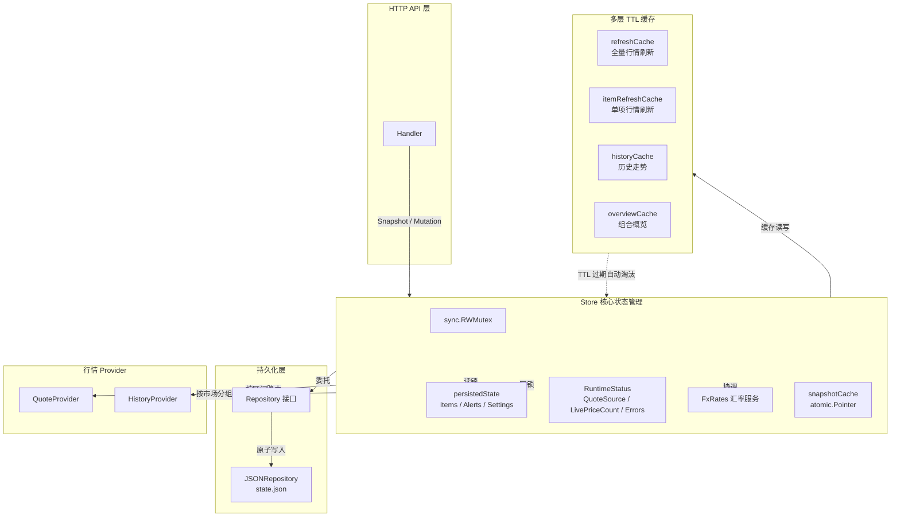
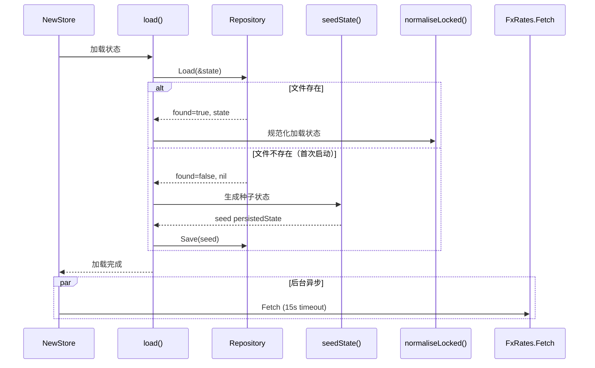
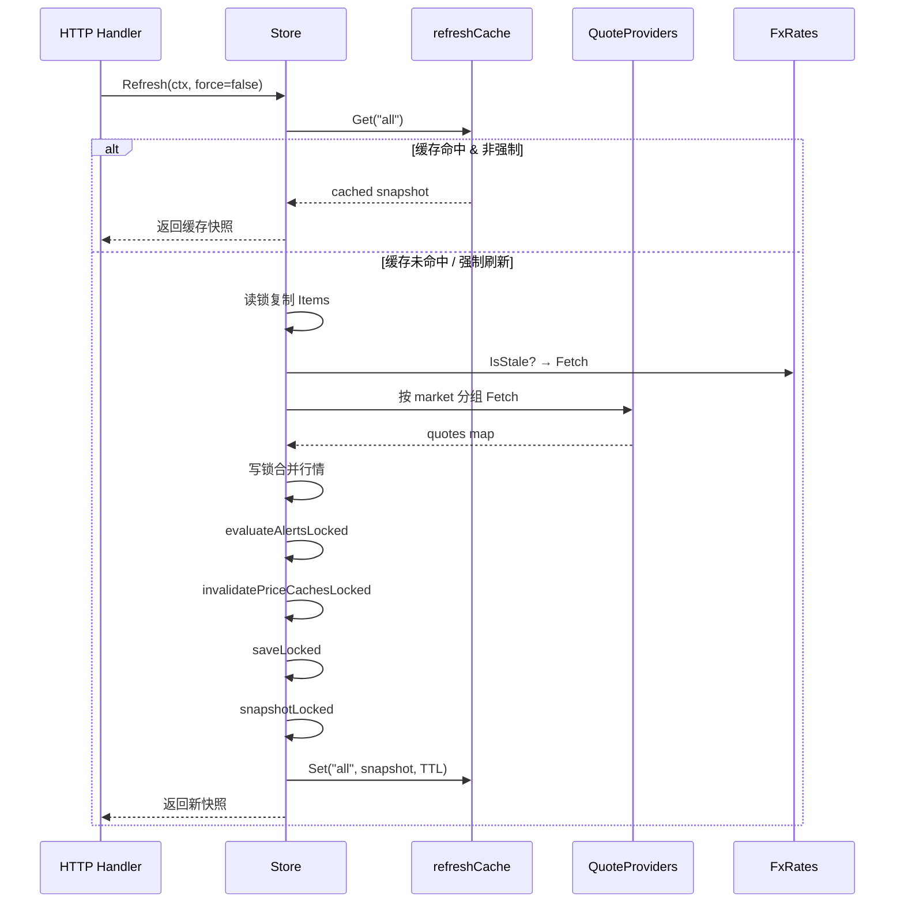

Store 是 InvestGo 后端的核心状态枢纽，承担用户持仓数据、价格提醒、应用配置的持久化存储与运行时协调职责。它将所有可变状态收敛于一个线程安全的单一实体中，对上通过 `StateSnapshot` 为 HTTP API 层提供只读视图，对下通过 `Repository` 抽象实现磁盘持久化，同时协调行情 Provider、汇率服务与多层缓存之间的数据流转。理解 Store 的内部机制，是掌握整个后端数据流的关键入口。

Sources: [store.go](internal/core/store/store.go#L1-L130)

## 架构总览

Store 的设计遵循 **单一状态源（Single Source of Truth）** 原则——所有前端需要的可变数据均由 Store 统一产出，任何组件不直接操作持久化文件或维护独立状态副本。这一原则通过以下三层架构实现：



**持久化层**（Repository 抽象 + JSONRepository 实现）负责将内存状态序列化为 JSON 并原子写入磁盘；**Store 核心**持有读写锁保护的 `persistedState` 和 `RuntimeStatus`，所有读写操作必须经过锁协议；**缓存层**以独立的 TTL Cache 隔离不同数据维度的刷新频率，避免重复网络请求；**Provider 层**按市场维度分组调度，确保 A 股走新浪与美股 Yahoo 等异构数据源互不干扰。

Sources: [store.go](internal/core/store/store.go#L24-L48), [repository.go](internal/core/store/repository.go#L1-L77), [cache.go](internal/core/store/cache.go#L1-L130)

## Store 结构体与字段语义

Store 结构体是整个状态管理系统的核心载体，每个字段都有明确的职责边界：

| 字段 | 类型 | 职责 |
|------|------|------|
| `mu` | `sync.RWMutex` | 读写锁，保护 `state`、`runtime`、`holdingsUpdatedAt` 的并发安全 |
| `repository` | `Repository` | 持久化后端抽象，默认为 JSONRepository |
| `quoteProviders` | `map[string]QuoteProvider` | 按源 ID 索引的行情提供者注册表 |
| `quoteSourceOptions` | `[]QuoteSourceOption` | 可供用户选择的行情源列表 |
| `historyProvider` | `HistoryProvider` | 历史数据路由器，按市场与区间分发 |
| `logs` | `*logger.LogBook` | 结构化日志记录器 |
| `state` | `persistedState` | **需持久化的核心状态**：Items、Alerts、Settings |
| `runtime` | `RuntimeStatus` | 运行时状态：最近刷新时间、行情源、版本号等 |
| `fxRates` | `*fx.FxRates` | 汇率转换服务，组合概览计算依赖 |
| `refreshCache` | `TTL[string, StateSnapshot]` | 全量行情刷新结果缓存（上限 32） |
| `itemRefreshCache` | `TTL[string, StateSnapshot]` | 单项行情刷新结果缓存（上限 32） |
| `historyCache` | `TTL[string, HistorySeries]` | 历史走势数据缓存（上限 512） |
| `overviewCache` | `TTL[string, cachedOverviewValue]` | 组合概览分析缓存（上限 16） |
| `holdingsUpdatedAt` | `time.Time` | 持仓结构变更时间戳，用于 overviewCache 的一致性守卫 |
| `snapshotCache` | `atomic.Pointer[cachedSnapshot]` | StateSnapshot 原子缓存，避免高频只读请求重复构建 |

`persistedState` 与 `RuntimeStatus` 的分离体现了**持久数据与瞬时数据**的架构边界——前者随用户操作变更并落盘，后者仅反映当前运行周期内的网络状态和统计信息，不需要持久化。

Sources: [store.go](internal/core/store/store.go#L24-L48), [state.go](internal/core/store/state.go#L12-L17), [model.go](internal/core/model.go#L296-L318)

## persistedState：持久化状态模型

`persistedState` 是 Store 中唯一需要写入磁盘的数据结构，包含四个字段：

```go
type persistedState struct {
    Items     []core.WatchlistItem `json:"items"`
    Alerts    []core.AlertRule     `json:"alerts"`
    Settings  core.AppSettings     `json:"settings"`
    UpdatedAt time.Time            `json:"updatedAt"`
}
```

**Items** 切片承载所有监控标的，无论是纯观察（`Quantity == 0` 且无 DCA 记录）还是实盘持仓（`Quantity > 0` 或有 DCA 记录），均使用同一 `WatchlistItem` 类型，前端通过 `Position.HasPosition` 字段区分视图。**Alerts** 切片存储价格提醒规则，通过 `ItemID` 与 Items 关联。**Settings** 包含全部用户偏好设置，从行情源选择到代理配置。**UpdatedAt** 是全局修改时间戳，同时作为 `snapshotCache` 的一致性戳和 `overviewCache` 的 `stateStamp` 守卫。

Sources: [state.go](internal/core/store/state.go#L12-L17), [model.go](internal/core/model.go#L53-L138)

### AppSettings 验证与规范化

`UpdateSettings` 接收用户输入后，经过 `sanitiseSettings` 的严格验证流水线，该函数采用**合并式更新策略**——非空字段覆盖当前配置，空字段保留原值，最终对合并结果进行完整性校验：

| 设置项 | 合法值 | 默认值 |
|--------|--------|--------|
| `HotCacheTTLSeconds` | ≥ 10 | 60 |
| `CNQuoteSource` / `HKQuoteSource` / `USQuoteSource` | 必须在已注册 Provider 中存在且支持对应市场 | `sina` / `xueqiu` / `yahoo` |
| `ThemeMode` | `system` / `light` / `dark` | `system` |
| `ColorTheme` | `blue` / `graphite` / `forest` / `sunset` / `rose` / `violet` / `amber` | `blue` |
| `FontPreset` | `system` / `reading` / `compact` | `system` |
| `ProxyMode` | `none` / `system` / `custom` | `system` |
| `DashboardCurrency` | `CNY` / `HKD` / `USD` | `CNY` |
| `Locale` | `system` / `zh-CN` / `en-US` | `system` |

对于付费 API 行情源（Alpha Vantage、Twelve Data、Finnhub、Polygon），`sanitiseSettings` 会校验对应的 API Key 是否已填写。自定义代理模式下，还会对 `ProxyURL` 执行 URL 解析验证，确保协议和主机名非空。

Sources: [settings_sanitize.go](internal/core/store/settings_sanitize.go#L12-L183)

## Repository 持久化机制

Repository 接口定义了极简的存储契约，将 Store 的核心逻辑与具体存储格式解耦：

```go
type Repository interface {
    Load(target any) (bool, error)  // 返回是否找到已有文件
    Save(source any) error
    Path() string
}
```

默认实现 `JSONRepository` 采用**原子写入**策略：先将序列化结果写入 `.tmp` 临时文件，再通过 `os.Rename` 原子替换目标文件。这确保了即使写入过程中发生崩溃或断电，原有的 `state.json` 始终保持完整，不会出现半写状态。存储路径默认为 `$HOME/Library/Application Support/investgo/state.json`（macOS），由 `main.go` 中的 `defaultStatePath()` 函数确定。

Sources: [repository.go](internal/core/store/repository.go#L11-L76), [main.go](main.go#L152-L158)

## 状态生命周期：加载 → 种子 → 规范化

Store 的初始化流程在 `NewStoreWithRepository` 中完成，经历以下阶段：



**种子状态**（`seedState`）为首次启动用户提供示例数据——阿里巴巴港股与 VOO 美股 ETF 两个持仓条目，以及两个价格提醒规则，使用户打开应用即可看到完整的数据展示效果。

**规范化**（`normaliseLocked`）是关键防御层，确保从磁盘加载的历史数据在所有必要字段上具有合法值。它会为缺失的 ID 补充随机 ID、为空名称回退到 Symbol、为零时间戳填充当前时间、为空 Settings 字段注入默认值、并根据已注册 Provider 校正行情源 ID。这一层保证了 Store 的任何后续操作都不会因历史数据的不完整而 panic。

Sources: [state.go](internal/core/store/state.go#L20-L121), [seed.go](internal/core/store/seed.go#L10-L93), [store.go](internal/core/store/store.go#L64-L101)

## 并发安全：读写锁协议

Store 使用 `sync.RWMutex` 保护所有对 `state`、`runtime`、`holdingsUpdatedAt` 的访问。其锁协议遵循一个严格的模式：

**只读操作**（如 `Snapshot`、`CurrentSettings`）获取读锁（`RLock`），允许多个读者并发执行。**写操作**（如 `UpsertItem`、`DeleteItem`、`UpdateSettings`、`Refresh`）获取写锁（`Lock`），独占访问。

一个关键的锁优化模式出现在 `UpsertItem` 中：该方法先以**读锁**获取 Provider 引用和已有条目信息，释放读锁后执行可能耗时的网络请求（行情获取），然后再以**写锁**执行状态修改和持久化。这避免了在写锁期间阻塞网络 I/O，显著降低了并发争用：

```go
// 第一阶段：读锁获取依赖
s.mu.RLock()
provider := s.activeQuoteProviderLocked(item.Market)
existing := ...
s.mu.RUnlock()

// 第二阶段：网络请求（无锁）
if provider != nil {
    quotes, quoteErr := provider.Fetch(ctx, []core.WatchlistItem{item})
    ...
}

// 第三阶段：写锁修改状态
s.mu.Lock()
defer s.mu.Unlock()
s.state.Items[index] = item
s.saveLocked()
```

类似地，`Refresh` 和 `RefreshItem` 也采用"读锁复制 → 无锁网络 → 写锁合并"的三段式协议，确保网络延迟不会阻塞其他读操作。

Sources: [mutation.go](internal/core/store/mutation.go#L20-L107), [runtime.go](internal/core/store/runtime.go#L22-L89)

## 变更操作（Mutation）

Store 提供六个核心变更操作，每个操作遵循统一的执行模式：**验证 → 修改状态 → 评估提醒 → 失效缓存 → 持久化 → 返回快照**。

### WatchlistItem 操作

| 操作 | 方法 | 锁策略 | 特殊行为 |
|------|------|--------|----------|
| 新增/更新 | `UpsertItem` | 读锁→无锁网络→写锁 | 新增时立即获取实时行情；更新时继承现有行情数据（`inheritLiveFields`） |
| 删除 | `DeleteItem` | 写锁 | 级联删除关联的 Alert 规则 |
| 置顶/取消 | `SetItemPinned` | 写锁 | 设置 `PinnedAt` 时间戳，快照排序时置顶项优先 |

`UpsertItem` 中的 `inheritLiveFields` 机制确保用户编辑标的（如修改持仓数量或成本价）时不会丢失最近一次行情刷新获取的实时价格数据——只有用户显式设置了 `CurrentPrice` 时才覆盖，否则保留现有值。

`DeleteItem` 的级联删除逻辑在删除标的后立即过滤掉所有 `ItemID` 匹配的 Alert 规则，避免悬空引用。

Sources: [mutation.go](internal/core/store/mutation.go#L20-L177)

### AlertRule 操作

`UpsertAlert` 和 `DeleteAlert` 操作相对简洁。新增提醒时，系统会校验关联的 `ItemID` 是否存在；每次变更后调用 `evaluateAlertsLocked` 重新评估所有提醒的触发状态——遍历所有 Alert，根据 `Condition`（`above` / `below`）与当前价格对比，设置 `Triggered` 标志并更新 `LastTriggeredAt`。

Sources: [mutation.go](internal/core/store/mutation.go#L179-L241), [state.go](internal/core/store/state.go#L131-L165)

### Settings 操作

`UpdateSettings` 通过 `sanitiseSettings` 合并用户输入与当前配置后进行完整性校验。更新设置会同时更新 `holdingsUpdatedAt`（因为行情源切换可能影响所有行情数据），并清空全部缓存层。

Sources: [mutation.go](internal/core/store/mutation.go#L243-L278)

## 快照构建与缓存策略

### StateSnapshot 结构

`Snapshot()` 是前端获取完整应用状态的唯一入口，返回一个包含所有前端所需数据的 `StateSnapshot`：

| 字段 | 来源 | 说明 |
|------|------|------|
| `Dashboard` | 实时计算 | 聚合总成本、总市值、盈亏、触发提醒数等，含汇率转换 |
| `Items` | persistedState | 排序后（置顶优先 → 更新时间倒序）的标的列表 |
| `Alerts` | persistedState | 排序后（已触发优先 → 更新时间倒序）的提醒列表 |
| `Settings` | persistedState | 当前应用配置 |
| `Runtime` | RuntimeStatus | 行情源、版本号、刷新状态等运行时信息 |
| `QuoteSources` | quoteSourceOptions | 可选行情源列表 |
| `StoragePath` | repository.Path() | 状态文件路径 |
| `GeneratedAt` | time.Now() | 快照生成时间 |

### 快照缓存机制

快照构建涉及排序、派生字段计算和 Dashboard 聚合，开销不可忽视。Store 使用 `atomic.Pointer[cachedSnapshot]` 实现无锁快照缓存，以 `state.UpdatedAt` 作为一致性戳：

```go
func (s *Store) snapshotLocked() core.StateSnapshot {
    stamp := s.state.UpdatedAt
    if entry := s.snapshotCache.Load(); entry != nil && entry.stamp.Equal(stamp) {
        return cloneStateSnapshot(entry.snapshot) // 快路径：返回浅拷贝
    }
    // 慢路径：重建快照...
    s.snapshotCache.Store(&cachedSnapshot{stamp: stamp, snapshot: cloneStateSnapshot(snapshot)})
    return snapshot
}
```

任何写操作或行情刷新都会通过 `invalidateAllCachesLocked` 或 `invalidatePriceCachesLocked` 将 `snapshotCache` 置为 `nil`，强制下次快照请求重新构建。`cloneStateSnapshot` 返回浅拷贝（重新分配 `Items`、`Alerts`、`QuoteSources` 切片），确保调用方修改返回值不会影响缓存。

Sources: [snapshot.go](internal/core/store/snapshot.go#L20-L75), [cache.go](internal/core/store/cache.go#L14-L18), [cache.go](internal/core/store/cache.go#L92-L98)

### 多层缓存失效策略

Store 维护五层独立缓存，各有不同的失效触发器和 TTL 策略：

| 缓存层 | 容量 | TTL | 失效触发器 |
|--------|------|-----|------------|
| `snapshotCache` | 1 | 无过期，按 stamp 匹配 | 结构变更 + 价格刷新 |
| `refreshCache` | 32 | `HotCacheTTLSeconds`（≥10s） | 结构变更 + 价格刷新 |
| `itemRefreshCache` | 32 | `HotCacheTTLSeconds` | 结构变更 + 价格刷新 |
| `historyCache` | 512 | 按区间分级（5min ~ 4h） | 仅结构变更 |
| `overviewCache` | 16 | `HotCacheTTLSeconds` | 结构变更 + 价格刷新 |

**结构变更**（Item 增删改、Settings 更新）触发 `invalidateAllCachesLocked`，清空全部五层缓存。**价格刷新**（`Refresh` / `RefreshItem`）触发 `invalidatePriceCachesLocked`，清空行情相关缓存和快照缓存，但**保留 `historyCache`**——因为历史 OHLCV 数据不受当前价格变动影响。

`historyCache` 采用按区间分级的 TTL 策略：1h 区间 5 分钟、1d 区间 10 分钟、1w/1mo 区间 30 分钟、1y/3y/all 区间 4 小时。短区间数据变化频率高，缓存时间短；长区间数据相对稳定，缓存时间更长。

Sources: [cache.go](internal/core/store/cache.go#L25-L90), [store.go](internal/core/store/store.go#L34-L48)

## 行情刷新流程

### 全量刷新（Refresh）



核心优化点在于：行情数据按市场分组后，**同一市场的标的一次性批量发送**给对应 Provider，避免逐条请求的网络开销。每个市场的 Provider 由 `settings.CNQuoteSource` / `HKQuoteSource` / `USQuoteSource` 决定。

### 单项刷新（RefreshItem）

`RefreshItem` 仅刷新指定 ID 的标的行情，缓存键为 `"itemID"`。它复用相同的 `refreshQuotesForItems` 内部方法，但只传入单个标的，适用于用户在详情页手动刷新的场景。

Sources: [runtime.go](internal/core/store/runtime.go#L22-L200)

## 提醒评估机制

`evaluateAlertsLocked` 在每次状态变更后执行，重建所有 Alert 的触发状态：

1. 先构建 `priceByItem` 索引（`ItemID → CurrentPrice`），避免在 Alert 循环中反复扫描 Items
2. 遍历所有 Alert，跳过 `Enabled == false` 的规则
3. 对每个启用的 Alert，查找对应 Item 的当前价格
4. 根据 `Condition` 判断：`AlertAbove` 在 `price >= threshold` 时触发，`AlertBelow` 在 `price <= threshold` 时触发
5. 触发时更新 `Triggered = true` 和 `LastTriggeredAt`

Sources: [state.go](internal/core/store/state.go#L131-L165)

## 派生字段计算（Enrichment）

快照构建时，每个 `WatchlistItem` 会通过 `decorateItemDerived` 注入三个服务端计算的派生字段，避免前端重复计算逻辑：

**DCAEntries.EffectivePrice**：每个 DCA 条目的有效买入价。若 `Price > 0`，直接使用 Price；否则从 `(Amount - Fee) / Shares` 推导。

**DCASummary**：DCA 条目聚合摘要。过滤有效条目（`Amount > 0 && Shares > 0`），汇总总金额、总份额、总费用，计算加权平均成本，若有当前价则计算市值和盈亏。

**PositionSummary**：持仓度量。从 `CostBasis()`（数量×成本价）和 `MarketValue()`（数量×现价）派生未实现盈亏及其百分比。

Sources: [enrichment.go](internal/core/store/enrichment.go#L1-L91)

## Dashboard 聚合与汇率转换

`buildDashboard` 在快照构建时为前端产出聚合数据，关键逻辑是**多币种统一换算**：

```
对于每个 Item:
  costBasis = item.CostBasis()              // Quantity × CostPrice
  marketValue = item.MarketValue()           // Quantity × CurrentPrice
  若 item.Currency ≠ displayCurrency:
    costBasis = fxRates.Convert(costBasis, item.Currency, displayCurrency)
    marketValue = fxRates.Convert(marketValue, item.Currency, displayCurrency)
  累加到 TotalCost / TotalValue
```

汇率数据由 `FxRates` 服务在后台异步获取（Store 初始化时启动 15 秒超时的 goroutine），并在每次 `Refresh` 时检测是否过期并自动刷新。`DashboardSummary` 中的 `WinCount` / `LossCount` 仅统计 `Quantity > 0 && CostPrice > 0` 的实盘持仓项，纯观察标的不计入盈亏统计。

Sources: [snapshot.go](internal/core/store/snapshot.go#L77-L123), [store.go](internal/core/store/store.go#L83-L99)

## 组合概览（Overview Analytics）

`OverviewAnalytics` 是 Store 中计算复杂度最高的方法，负责为前端仪表盘提供持仓分布饼图和组合趋势堆叠图数据。其执行流程：

1. **过滤**：仅保留有实际持仓的标的（`Quantity > 0` 或有有效 DCA 条目）
2. **分布计算**（`buildBreakdown`）：将每个持仓的市值换算为统一货币，计算权重百分比，按市值降序排列
3. **趋势计算**（`buildTrend`）：
   - 为每个持仓确定首次买入日期和历史区间（1y/3y/all）
   - 并发加载历史数据（最多 4 路并行）
   - 对 DCA 持仓，按日期回放买入记录，累加持仓份额
   - 对固定份额持仓，直接以 `Quantity × Close` 乘以汇率换算
   - 将所有持仓的日度市值对齐到统一时间轴，汇总为组合总值

趋势计算通过 `ItemHistory` 间接获取历史数据，**复用 `historyCache`**，避免在概览重建时发起冗余网络请求。`overviewCache` 以 `holdingsUpdatedAt` 作为 `stateStamp` 守卫——当持仓结构发生变更时，即使缓存未过期也会强制重建。

Sources: [runtime.go](internal/core/store/runtime.go#L243-L293), [overview.go](internal/core/store/overview.go#L1-L399)

## 日志脱敏

Store 的日志方法（`logInfo` / `logWarn` / `logError`）在写入 LogBook 前通过 `redactSensitiveLogText` 进行脱敏处理。该函数使用正则表达式匹配 API Key 等敏感字段，将其值替换为 `***`，确保日志中不会泄露 Alpha Vantage、Twelve Data、Finnhub、Polygon 等付费服务的密钥。

Sources: [mutation.go](internal/core/store/mutation.go#L338-L375)

## 与应用入口的集成

在 `main.go` 中，Store 的初始化位于应用启动链的核心位置：

1. 创建 `LogBook` 和共享 `http.Client`（含代理传输层）
2. 构建 `marketdata.Registry`（注册所有行情 Provider）
3. 调用 `store.NewStore` 加载/种子状态
4. 将 `store.CurrentSettings` 接入 Registry 和 ProxyTransport 作为配置回调
5. 从初始快照读取代理配置并应用
6. 将 Store 注入 API Handler，所有 HTTP 端点通过 Store 方法操作状态

应用关闭时（`OnShutdown`），调用 `store.Save()` 确保最终状态落盘。然而在正常操作流程中，每次变更操作都会立即调用 `saveLocked()` 持久化——Store 采用的是**写后即存（Write-Through）**策略，而非延迟批量写入。

Sources: [main.go](main.go#L38-L149)

## 设计要点总结

| 设计决策 | 实现方式 | 优势 |
|----------|----------|------|
| 单一状态源 | 所有可变状态集中在 Store | 消除状态不一致风险 |
| 原子持久化 | `.tmp` + `os.Rename` | 崩溃安全，无半写状态 |
| 三段式锁协议 | 读锁→无锁网络→写锁 | 网络延迟不阻塞并发读者 |
| 写后即存 | 每次变更后 `saveLocked()` | 数据丢失窗口最小化 |
| 快照缓存 | `atomic.Pointer` + stamp 匹配 | 高频只读请求零锁开销 |
| 分层缓存失效 | 结构变更 vs 价格刷新 | 保留不相关缓存，减少重复计算 |
| 合并式设置更新 | `sanitiseSettings` | 支持部分更新，空字段保留原值 |
| 数据规范化 | `normaliseLocked` | 兼容历史版本数据，防御性编程 |
| 日志脱敏 | 正则替换 API Key | 防止敏感信息泄露到日志 |

---

**继续阅读**：
- 了解行情数据如何按 Provider 分发：[行情数据 Provider 注册与路由机制](7-xing-qing-shu-ju-provider-zhu-ce-yu-lu-you-ji-zhi)
- 了解前端如何消费 StateSnapshot：[前后端状态同步与快照机制](22-qian-hou-duan-zhuang-tai-tong-bu-yu-kuai-zhao-ji-zhi)
- 了解缓存层的 TTL 实现细节：[缓存策略与失效机制](12-huan-cun-ce-lue-yu-shi-xiao-ji-zhi)