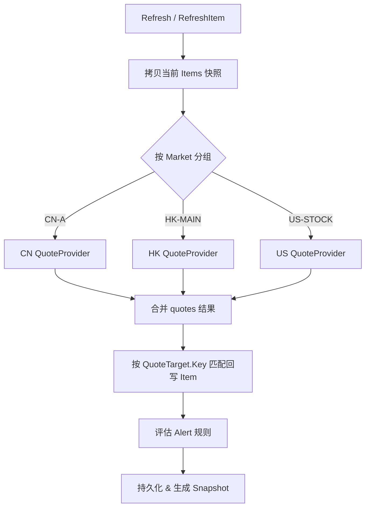
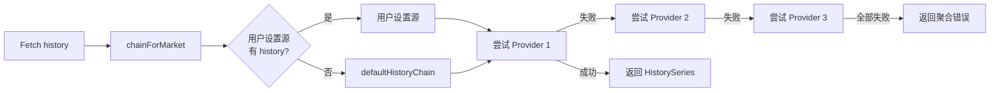
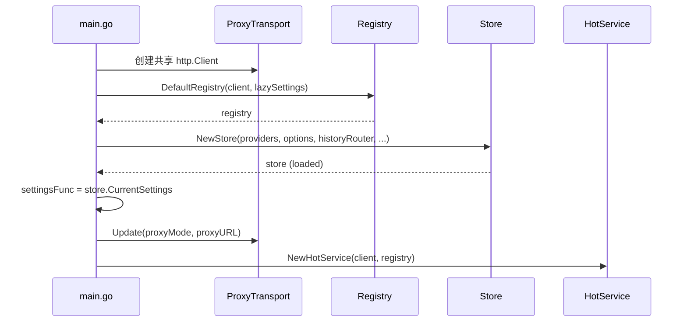

InvestGo 的行情系统采用**注册表（Registry）+ 策略路由**的架构设计，将十家外部数据源的接入、能力声明与运行时调度解耦。所有 Provider 在启动时一次性注册到中心注册表，Store 在刷新行情时根据用户为各市场（CN/HK/US）独立配置的 Quote Source 进行动态路由，而历史数据则通过独立的 `HistoryRouter` 按能力链式回退。本文档聚焦这一注册与路由体系的整体结构、接口契约与启动依赖链，不涉及单个 Provider 的协议解析细节。

## 核心接口契约

行情系统的最小抽象单元定义在 `core` 包中，包含两个能力接口与一个标准化目标对象。**`QuoteProvider`** 负责批量实时报价，**`HistoryProvider`** 负责单品种历史序列，二者通过 **`QuoteTarget`** 实现跨 Provider 的键值统一。

```go
type QuoteProvider interface {
    Fetch(ctx context.Context, items []WatchlistItem) (map[string]Quote, error)
    Name() string
}

type HistoryProvider interface {
    Fetch(ctx context.Context, item WatchlistItem, interval HistoryInterval) (HistorySeries, error)
    Name() string
}
```

`QuoteTarget` 是路由层的标准化产物，包含 `Key`（跨 Provider 查找键）、`DisplaySymbol`、`Market` 与 `Currency`。无论用户在自选股中输入 `00700`、`HK00700` 还是 `00700.HK`，`ResolveQuoteTarget` 都会将其收敛为统一的 `00700.HK` 作为 `Key`。Store 在回写报价时即以该 `Key` 做匹配，而非原始 symbol 字符串。Sources: [model.go](internal/core/model.go#L349-L371), [quote_resolver.go](internal/core/quote_resolver.go#L49-L76)

## Registry 注册中心

`marketdata.Registry` 是 Provider 的唯一权威来源，负责维护所有数据源的注册顺序、能力声明与实例复用。其内部以 `map[string]*DataSource` 存储，并以 `order []string` 保留注册顺序供前端设置界面使用。

`DataSource` 是对单一外部渠道的封装，将 `QuoteProvider`、`HistoryProvider`、支持的 `markets` 列表及 UI 元数据（名称、描述）聚合在同一实体中：

| 字段 | 作用 |
|---|---|
| `id` | 全局唯一标识，如 `eastmoney`、`yahoo`、`alpha-vantage` |
| `quote` | 实时报价能力，可为 `nil` |
| `history` | 历史 K 线能力，可为 `nil` |
| `markets` | 该源覆盖的市场列表，用于校验用户设置的有效性 |

`Registry.Register` 允许静默覆盖同 ID 的已有源，这一设计使得测试或插件化扩展时可以无侵入地替换默认实现。Sources: [registry.go](internal/core/marketdata/registry.go#L15-L90)

### DefaultRegistry 的启动装配

`DefaultRegistry` 在应用启动时完成全部已知 Provider 的实例化。所有 Provider 共享同一个 `*http.Client`，确保代理传输层（Proxy Transport）的配置全局生效。以下是注册顺序与能力概览：

| ID | 名称 | Quote | History | 覆盖市场 |
|---|---|:---:|:---:|:---|
| `eastmoney` | EastMoney | ✅ | ✅ | CN-A, CN-GEM, CN-STAR, CN-ETF, HK-MAIN, HK-GEM, HK-ETF, US-STOCK, US-ETF |
| `yahoo` | Yahoo Finance | ✅ | ✅ | 同上 |
| `sina` | Sina Finance | ✅ | ❌ | 同上 |
| `xueqiu` | Xueqiu | ✅ | ❌ | 同上 |
| `tencent` | Tencent Finance | ✅ | ✅ | 同上 |
| `alpha-vantage` | Alpha Vantage | ✅ | ✅ | US-STOCK, US-ETF |
| `twelve-data` | Twelve Data | ✅ | ✅ | US-STOCK, US-ETF |
| `finnhub` | Finnhub | ✅ | ✅ | US-STOCK, US-ETF |
| `polygon` | Polygon | ✅ | ✅ | US-STOCK, US-ETF |

注意 Sina 与 Xueqiu 仅提供实时报价，没有历史数据 API；这一差异会在后文的 `HistoryRouter` 中被自动处理。Sources: [registry.go](internal/core/marketdata/registry.go#L185-L295)

## Store 层行情路由

Store 并不直接感知 Provider 的构造过程，而是通过构造函数注入 `quoteProviders map[string]core.QuoteProvider` 与 `quoteSourceOptions []core.QuoteSourceOption`。运行时，Store 根据 `WatchlistItem.Market` 将品种分组，再按市场找到当前生效的 Provider 执行批量拉取。

### 按市场分组与 Provider 选择

`refreshQuotesForItems` 是行情刷新的核心调度函数。它对传入的自选股列表执行以下步骤：

1. **市场分组**：遍历每个 item，调用 `activeQuoteSourceIDLocked(item.Market)` 与 `activeQuoteProviderLocked(item.Market)`，将 item 按 Provider ID 归入 `map[string][]WatchlistItem`。
2. **批量请求**：对每个分组调用 `Provider.Fetch(ctx, batch)`，返回 `map[string]core.Quote`。
3. **结果合并**：将所有批次的报价按 `QuoteTarget.Key` 合并到统一结果集。
4. **FX 汇率 opportunistic 刷新**：若汇率缓存过期，同步发起 FX 请求，确保仪表盘汇率换算与报价同步。



Sources: [runtime.go](internal/core/store/runtime.go#L22-L200), [runtime.go](internal/core/store/runtime.go#L158-L200)

### 市场到 Provider 的映射策略

Store 通过三层防御策略确保始终返回合法 Provider：

1. **用户设置优先**：读取 `Settings.CNQuoteSource` / `HKQuoteSource` / `USQuoteSource`，校验该 Provider 是否存在于 `quoteProviders` 且其 `SupportedMarkets` 包含目标市场。
2. **市场默认回退**：若用户设置无效，使用 `DefaultCNQuoteSourceID`（`sina`）、`DefaultHKQuoteSourceID`（`xueqiu`）、`DefaultUSQuoteSourceID`（`yahoo`）。
3. **全局兜底**：若默认源也未注册，遍历 `quoteProviders` 返回第一个可用实例。

`normaliseQuoteSourceIDLocked` 实现了上述校验与回退逻辑，并在状态加载时由 `normaliseLocked` 调用，确保磁盘中的旧设置被自动修正到当前可用 Provider。Sources: [state.go](internal/core/store/state.go#L235-L322)

## HistoryRouter 历史数据路由

历史数据路由与实时报价路由独立设计，原因在于两者的 Provider 覆盖能力不同（Sina、Xueqiu 无历史 API）。`HistoryRouter` 接收 `map[string]core.HistoryProvider` 与用户设置懒加载函数 `settings func() core.AppSettings`，在每次 `Fetch` 时动态构建 Provider 链。

### Fallback 链规则

`chainForMarket` 的构建遵循两条规则：

1. **用户首选优先**：若用户为该市场配置的 Quote Source 同时具备 History 能力（即存在于 `HistoryRouter.providers` 中），则将其置于链首。例如用户将 US Quote Source 设为 `finnhub`，则历史数据优先走 Finnhub。
2. **默认链兜底**：当首选源无历史能力时（如 Sina），使用 `defaultHistoryChain` 作为回退顺序。



各市场的默认历史链如下：

| 市场分组 | 默认链顺序 |
|---|---|
| US | `yahoo` → `finnhub` → `polygon` → `alpha-vantage` → `twelve-data` → `eastmoney` |
| CN / HK | `yahoo` → `eastmoney` |

US 市场链故意将无 API Key 的免费源（Yahoo、EastMoney）置于尾部，优先尝试用户可能已配置付费 Key 的专业源，兼顾启动可用性与数据质量。Sources: [history_router.go](internal/core/marketdata/history_router.go#L43-L161)

## 启动依赖注入链

Provider 注册与路由机制的装配发生在 `main.go` 的启动阶段，形成严格的依赖顺序：

1. **HTTP Client 与 Proxy Transport**：先创建共享的 `http.Client`，使所有 Provider 与 FX 模块共享同一传输层。
2. **Registry 实例化**：`marketdata.DefaultRegistry(httpClient, settingsFunc)` 注册全部 Provider。此时 `settingsFunc` 返回空值，因为 Store 尚未就绪；Registry 仅将函数引用保存到各 Provider 内部，实现**懒加载**。
3. **Store 创建**：`store.NewStore(..., registry.QuoteProviders(), registry.QuoteSourceOptions(), registry.NewHistoryRouter(settingsFunc), ...)` 将 Registry 中的 quote 与 history 能力注入 Store。
4. **Settings 回环绑定**：Store 加载完成后，`settingsFunc = store.CurrentSettings` 将真正的设置读取器回注到 Registry 内的 Provider（如 Alpha Vantage、Finnhub 等需要 API Key 的源）以及 HistoryRouter。
5. **HotService 创建**：`hot.NewHotService(httpClient, ..., registry)` 接收 Registry 引用，用于热门榜单的 quote overlay。



Sources: [main.go](main.go#L59-L91)

## 跨子系统复用：HotService 的 Quote Overlay

`Registry` 的设计不仅服务于 Store，也被 `HotService` 直接消费。热门榜单的数据源（如 EastMoney 排行 API）返回的成分股列表默认使用 EastMoney 报价；当用户将某市场的 Quote Source 配置为非 EastMoney 时，`HotService` 通过 `registry.QuoteProvider(sourceID)` 获取对应 Provider，对榜单结果执行二次报价覆盖（Quote Overlay），确保用户在任何页面看到的实时价格都与其设置保持一致。若目标 Provider 返回空结果，对应品种会被丢弃，避免展示 stale 数据。Sources: [enrich.go](internal/core/hot/enrich.go#L14-L80)

## 相关阅读

Provider 注册与路由机制是 InvestGo 后端数据层的枢纽，理解本文档后，可继续深入以下相邻主题：

- 若需了解用户输入的 symbol 如何被解析为标准化的 `QuoteTarget`，请参阅 [行情符号规范化与市场解析](8-xing-qing-fu-hao-gui-fan-hua-yu-shi-chang-jie-xi)
- 若需了解单个 Provider 的协议实现细节（如 EastMoney 的 batch secid 格式、Yahoo 的 crumb 机制），请参阅 [Provider 实现详解](25-dong-fang-cai-fu-yu-xin-lang-xing-qing-provider) 系列
- 若需了解历史走势图的数据加载与缓存策略，请参阅 [历史走势图数据加载与缓存](24-li-shi-zou-shi-tu-shu-ju-jia-zai-yu-huan-cun)
- 若需了解 Store 的整体状态管理、持久化与快照机制，请参阅 [Store 核心状态管理与持久化](6-store-he-xin-zhuang-tai-guan-li-yu-chi-jiu-hua)
- 若需了解热门榜单的多源聚合与 quote overlay 的完整流程，请参阅 [热门榜单服务与多源聚合](9-re-men-bang-dan-fu-wu-yu-duo-yuan-ju-he)