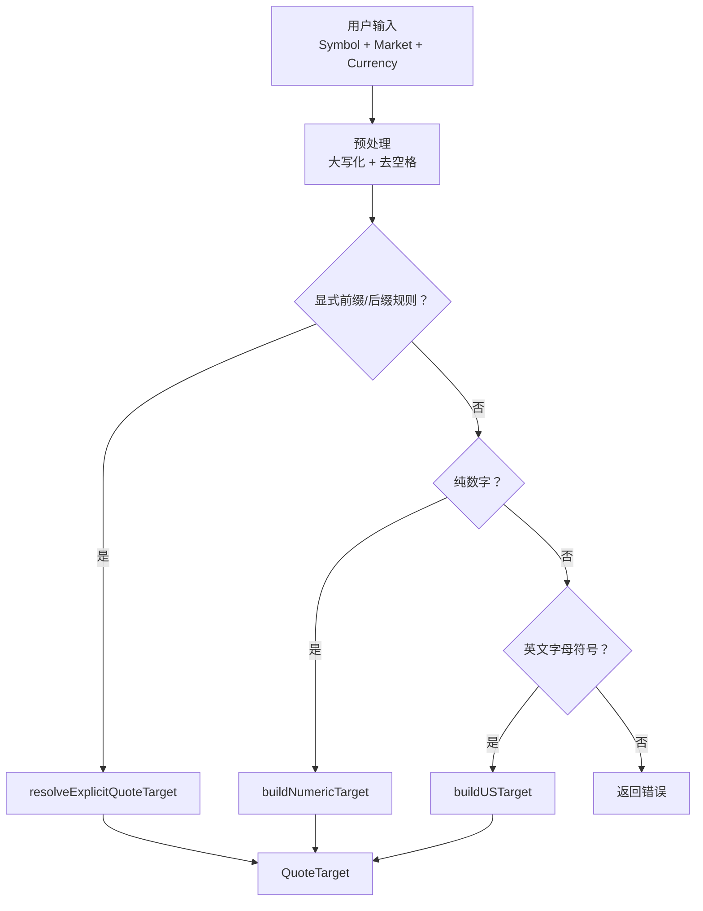
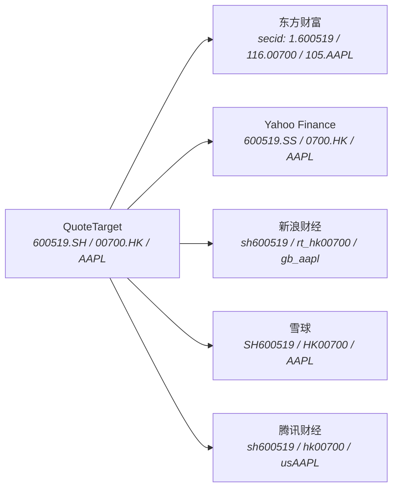
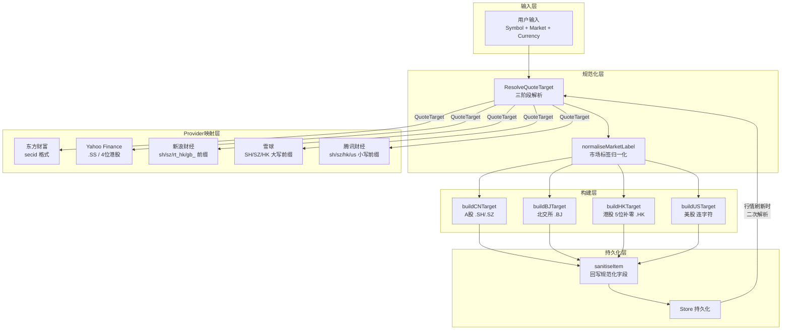

InvestGo 作为一个跨市场（A股、港股、美股）的桌面行情追踪应用，其核心挑战之一在于：**用户输入的符号格式千差万别，而各行情数据源 API 对符号格式的要求各不相同**。`ResolveQuoteTarget` 函数链正是解决这一问题的关键架构——它将用户自由形式的输入规范化为内部统一的 `QuoteTarget`，再由各 Provider 将其映射为 API 特定的查询标识符。本章将深入解析这一从用户输入到 API 调用的完整规范化管线。

## QuoteTarget：规范化管线的数据契约

`QuoteTarget` 是整个符号规范化管线的输出，也是所有行情 Provider 的输入契约。它承载四个关键字段：

| 字段 | 含义 | 示例 |
|------|------|------|
| `Key` | 唯一标识键，用于 Provider 返回结果的匹配 | `"600519.SH"` / `"00700.HK"` / `"AAPL"` |
| `DisplaySymbol` | 展示用符号，与 Key 大致相同但语义侧重展示 | `"600519.SH"` / `"00700.HK"` / `"AAPL"` |
| `Market` | 标准化市场标识 | `"CN-A"` / `"HK-MAIN"` / `"US-STOCK"` |
| `Currency` | 默认结算货币 | `"CNY"` / `"HKD"` / `"USD"` |

该结构体在 [model.go](internal/core/model.go#L362-L368) 中定义，是 Store 刷新行情时匹配 Quote 结果的核心索引键——`Refresh` 方法通过 `ResolveQuoteTarget` 逐项解析 `WatchlistItem`，再以 `target.Key` 查找 Provider 返回的 `map[string]Quote`，从而完成价格数据的回写。

Sources: [model.go](internal/core/model.go#L362-L368)

## 解析主流程：从自由输入到规范目标

`ResolveQuoteTarget` 是规范化管线的入口函数，接收 `WatchlistItem` 后委托给内部函数 `resolveQuoteTarget(symbol, market, currency)` 执行三阶段解析。



### 预处理阶段

输入在进入分支判断前先经过统一预处理：符号被 `ToUpper + TrimSpace`，空格被移除，市场标签通过 `normaliseMarketLabel` 映射到内部规范形式。这一步确保后续分支逻辑处理的始终是标准化输入。

Sources: [quote_resolver.go](internal/core/quote_resolver.go#L34-L41)

### 阶段一：显式前缀/后缀解析

当用户输入携带了明确的市场标识时，系统优先识别并直接路由。这一机制通过两组规则实现——**前缀规则**（`HK`、`SH`、`SZ`、`BJ`）和**后缀规则**（`.HK`、`.SH`、`.SZ`、`.BJ`）。此外还有一个特殊规则 `GB_` 前缀用于标记美股符号（如 `GB_AAPL` → 美股 AAPL）。

前缀与后缀的解析逻辑被统一抽象为 `resolveAffixedQuoteTarget` 函数，它接受一组 `quoteAffixRule` 规则和一个 `trim` 函数（`strings.CutPrefix` 或 `strings.CutSuffix`），遍历规则匹配后剩余部分必须为纯数字，才路由到对应的交易所构建器。

| 用户输入 | 匹配规则 | 剩余部分 | 路由到 |
|---------|---------|---------|-------|
| `SH600519` | 前缀 `SH` | `600519` | `buildCNTarget("600519", "SH", ...)` |
| `00700.HK` | 后缀 `.HK` | `00700` | `buildHKTarget("00700", ...)` |
| `SZ000001` | 前缀 `SZ` | `000001` | `buildCNTarget("000001", "SZ", ...)` |
| `GB_AAPL` | 前缀 `GB_` | `AAPL` | `buildUSTarget("AAPL", ...)` |

Sources: [quote_resolver.go](internal/core/quote_resolver.go#L61-L93)

### 阶段二：纯数字符号推断

当符号为纯数字且无显式市场标识时，系统依据数字长度和首位数字进行智能推断：

- **5 位数字**：默认推断为港股主板上市场码（如 `700` → `00700.HK`，补零到 5 位）
- **6 位数字**：依据首位/前两位数字推断 A 股子市场：

| 首位/前缀 | 推断市场 | 交易所 | 示例 |
|----------|---------|-------|------|
| `6` / `9` | CN-A（主板） | SH | `600519` → `600519.SH` |
| `688` / `689` | CN-STAR（科创板） | SH | `688981` → `688981.SH` |
| `5` | CN-ETF | SH | `510050` → `510050.SH` |
| `3` | CN-GEM（创业板） | SZ | `300750` → `300750.SZ` |
| `15` / `16` | CN-ETF | SZ | `159915` → `159915.SZ` |
| `0` / `1` / `2` | CN-A（主板） | SZ | `000001` → `000001.SZ` |
| `4` / `8` | CN-BJ（北交所） | BJ | `830799` → `830799.BJ` |

若用户通过 `market` 字段显式指定了 `HK-MAIN`、`HK-GEM`、`HK-ETF`、`CN-BJ` 或 `BJ` 等市场类型，则优先按指定市场处理，而非依赖前缀推断。

Sources: [quote_resolver.go](internal/core/quote_resolver.go#L108-L141), [quote_resolver.go](internal/core/quote_resolver.go#L248-L275)

### 阶段三：英文字母符号处理

纯字母或含 `.` / `-` 的符号被识别为美股代码。`normaliseUSSymbol` 将内部的连字符格式统一（如 `BRK-B` 保持不变），市场标签根据用户指定决定是 `US-STOCK` 还是 `US-ETF`，货币默认 `USD`。

此外还有一条辅助规则：若符号以 `US` 开头且剩余部分为合法美股符号格式（如 `USAAPL`），则剥离 `US` 前缀后按美股处理。

Sources: [quote_resolver.go](internal/core/quote_resolver.go#L200-L218), [quote_resolver.go](internal/core/quote_resolver.go#L339-L344)

## 市场标签规范化体系

`normaliseMarketLabel` 将用户可能传入的各种市场标签变体统一映射为内部规范标识：

| 输入变体 | 规范输出 | 说明 |
|---------|---------|------|
| `A-SHARE`, `ASHARE`, `CN`, `A`, `CN-A` | `CN-A` | A 股主板 |
| `CN-GEM`, `GEM` | `CN-GEM` | 创业板 |
| `CN-STAR`, `STAR` | `CN-STAR` | 科创板 |
| `CN-ETF`, `CNETF` | `CN-ETF` | A 股 ETF |
| `CN-BJ`, `BJ` | `CN-BJ` | 北交所 |
| `HK`, `H-SHARE` | `HK-MAIN` | 港股（默认主板） |
| `HK-MAIN`, `HK-GEM`, `HK-ETF` | 原值保留 | 港股子分类 |
| `US`, `NASDAQ`, `NYSE`, `US-NYQ` | `US-STOCK` | 美股 |
| `US ETF`, `ETF`, `US-ETF` | `US-ETF` | 美股 ETF |

这一映射确保了无论前端传入何种格式的市场标签，后端处理逻辑始终面对有限的、确定性的市场枚举值。

Sources: [quote_resolver.go](internal/core/quote_resolver.go#L221-L246)

## 各市场构建器的格式化规则

### A 股构建器 `buildCNTarget`

6 位数字代码后追加上交所 `.SH` 或深交所 `.SZ` 后缀，构成 `Key` 和 `DisplaySymbol`。若 `market` 为空则默认为 `CN-A`，货币默认 `CNY`。市场子分类（`CN-GEM`、`CN-STAR`、`CN-ETF`）在 `resolveCNMarket` 中优先保留用户指定值，仅当用户未指定细分市场时才由代码前缀推断。

Sources: [quote_resolver.go](internal/core/quote_resolver.go#L144-L159), [quote_resolver.go](internal/core/quote_resolver.go#L278-L288)

### 北交所构建器 `buildBJTarget`

格式与 A 股类似，但固定后缀 `.BJ`，市场标签固定 `CN-BJ`，货币默认 `CNY`。

Sources: [quote_resolver.go](internal/core/quote_resolver.go#L162-L173)

### 港股构建器 `buildHKTarget`

港股 API 要求 5 位数字代码，因此 `buildHKTarget` 会将不足 5 位的代码左侧补零（如 `700` → `00700`），后缀统一 `.HK`。若用户未指定细分市场则默认 `HK-MAIN`，货币默认 `HKD`。`resolveHKMarket` 仅在用户显式指定 `HK-GEM` 或 `HK-ETF` 时保留，其余一律归为主板。

Sources: [quote_resolver.go](internal/core/quote_resolver.go#L176-L198), [quote_resolver.go](internal/core/quote_resolver.go#L291-L297)

### 美股构建器 `buildUSTarget`

美股代码直接作为 `Key` 和 `DisplaySymbol`，内部格式统一使用连字符（如 `BRK-B`）。市场标签由用户输入或默认推导为 `US-STOCK`（当 `market` 为 `US-ETF` 或 `US ETF` 时标记为 `US-ETF`），货币默认 `USD`。

Sources: [quote_resolver.go](internal/core/quote_resolver.go#L200-L218)

## Provider 层的二次映射：从 QuoteTarget 到 API 标识符

`QuoteTarget` 虽然提供了统一格式，但各行情源 API 要求的符号格式各不相同。每个 Provider 内部都实现了自己的 `resolve*` 函数，将 `QuoteTarget` 映射为 API 特定的查询标识符：



### 东方财富 secid 映射

东方财富 API 使用 `市场代码.证券代码` 格式的 `secid` 查询行情，其市场代码与内部市场标识完全不同：

| 内部格式 | 东方财富 secid | 市场代码含义 |
|---------|--------------|-----------|
| `600519.SH` | `1.600519` | 1 = 上交所 |
| `000001.SZ` | `0.000001` | 0 = 深交所 |
| `00700.HK` | `116.00700` | 116 = 港股 |
| `AAPL` (美股) | `105.AAPL`, `106.AAPL`, `107.AAPL` | 105=NASDAQ, 106=NYSE, 107=NYSE Arca |

美股的 secid 映射特殊之处在于同一只股票可能在不同交易所上市，因此 `ResolveAllEastMoneySecIDs` 返回所有三个交易所变体，行情请求会逐一尝试直到命中。

此外，东方财富的批量行情 API 在返回数据时使用 `MarketID + Code` 标识，但 Code 可能缺失前导零，因此 `NormaliseEastMoneyCode` 负责按市场 ID 补零（港股补至 5 位，沪深补至 6 位），确保回写匹配时 secid 格式一致。

Sources: [eastmoney.go](internal/core/provider/eastmoney.go#L401-L438), [eastmoney.go](internal/core/provider/eastmoney.go#L661-L675)

### Yahoo Finance 符号映射

Yahoo Finance 使用与内部格式略有不同的后缀体系：上交所使用 `.SS`（而非 `.SH`），深交所 `.SZ` 保持不变，港股 `.HK` 保持不变但 Yahoo 使用 4 位代码格式（去除前导零但保证至少 4 位）。美股代码直接透传。

| 内部格式 | Yahoo 符号 |
|---------|-----------|
| `600519.SH` | `600519.SS` |
| `000001.SZ` | `000001.SZ` |
| `00700.HK` | `0700.HK` |
| `AAPL` | `AAPL` |

Sources: [yahoo.go](internal/core/provider/yahoo.go#L366-L394)

### 新浪财经代码映射

新浪财经使用小写前缀标识市场，格式为 `前缀+代码`：

| 内部格式 | 新浪代码 |
|---------|---------|
| `600519.SH` | `sh600519` |
| `000001.SZ` | `sz000001` |
| `830799.BJ` | `bj830799` |
| `00700.HK` | `rt_hk00700` |
| `AAPL` | `gb_aapl` |

Sources: [sina.go](internal/core/provider/sina.go#L106-L121)

### 雪球符号映射

雪球使用大写前缀标识市场：

| 内部格式 | 雪球符号 |
|---------|---------|
| `600519.SH` | `SH600519` |
| `000001.SZ` | `SZ000001` |
| `00700.HK` | `HK00700` |
| `AAPL` | `AAPL` |

注意雪球不支持北交所（`.BJ` 后缀会返回错误）。

Sources: [xueqiu.go](internal/core/provider/xueqiu.go#L169-L184)

### 腾讯财经代码映射

腾讯财经行情接口使用小写前缀，K 线接口使用小写前缀加交易所后缀：

| 内部格式 | 行情代码 | 历史 K 线代码 |
|---------|---------|-------------|
| `600519.SH` | `sh600519` | `sh600519` |
| `000001.SZ` | `sz000001` | `sz000001` |
| `00700.HK` | `hk00700` | `hk00700` |
| `AAPL` | `usAAPL` | `usAAPL.OQ`, `usAAPL.N` |

美股历史 K 线代码会生成两个候选（`.OQ` = NASDAQ, `.N` = NYSE），逐一尝试直到成功。

Sources: [tencent.go](internal/core/provider/tencent.go#L326-L363)

## 规范化管线在数据流中的位置

`ResolveQuoteTarget` 在整个应用数据流中有两个核心调用点，分别对应**数据写入路径**和**数据读取路径**：

### 写入路径：项目创建/更新时的规范化

当用户通过 `UpsertItem` 添加或修改关注项时，`sanitiseItem` 首先调用 `ResolveQuoteTarget` 解析用户输入，随后用解析结果的 `DisplaySymbol`、`Market`、`Currency` 回写到 `WatchlistItem`，确保持久化到磁盘的数据始终是规范化形式。这意味着后续所有读取操作面对的都是已标准化的数据。

```go
target, err := core.ResolveQuoteTarget(item)
// ...
item.Symbol = target.DisplaySymbol
item.Market = target.Market
item.Currency = target.Currency
```

Sources: [mutation.go](internal/core/store/mutation.go#L281-L295)

### 读取路径：行情刷新时的二次解析

`Store.Refresh` 和 `Store.RefreshItem` 在行情刷新时再次调用 `ResolveQuoteTarget`，将持久化的 `WatchlistItem` 解析为 `QuoteTarget`，以 `target.Key` 为索引键匹配 Provider 返回的 `Quote` 数据。这一设计保证即使持久化数据与 Provider 返回格式存在细微差异（例如港股补零），行情仍能正确匹配。

```go
for idx := range s.state.Items {
    target, err := core.ResolveQuoteTarget(s.state.Items[idx])
    if err != nil { continue }
    quote, ok := result.quotes[target.Key]
    if !ok { continue }
    applyQuoteToItem(&s.state.Items[idx], quote)
}
```

Sources: [runtime.go](internal/core/store/runtime.go#L44-L55)

## Provider 层的统一收集模式

所有行情 Provider 的 `Fetch` 方法遵循同一模式：调用 `CollectQuoteTargets` 批量解析输入项目、生成 `targets` 映射和错误列表，然后按 API 需求将 `QuoteTarget` 转换为各自的查询标识符，最后以 `target.Key` 为键将结果写回 `quotes` 映射。

```go
targets, problems := CollectQuoteTargets(items)
// ... 各 Provider 特有的 API 查询逻辑 ...
quotes[target.Key] = quote
```

`CollectQuoteTargets` 封装了遍历、解析、错误收集三个步骤，使得每个 Provider 的 `Fetch` 方法可以聚焦于 API 交互逻辑，而不必重复编写解析代码。

Sources: [helpers.go](internal/core/provider/helpers.go#L21-L35)

## 市场分组与 Provider 路由

虽然 `QuoteTarget` 的 `Market` 字段细分到 `CN-A`、`CN-GEM`、`CN-STAR` 等粒度，但 Provider 路由按三大市场组聚合：

| 市场组 | 包含的细分市场 | 默认行情源 | 默认历史源链 |
|-------|-------------|----------|-----------|
| `cn` | CN-A, CN-GEM, CN-STAR, CN-ETF, CN-BJ | sina | yahoo → eastmoney |
| `hk` | HK-MAIN, HK-GEM, HK-ETF | xueqiu | yahoo → eastmoney |
| `us` | US-STOCK, US-ETF | yahoo | yahoo → finnhub → polygon → alpha-vantage → twelve-data → eastmoney |

`marketGroupForMarket` 函数负责将细分市场映射到市场组，Store 在 `refreshQuotesForItems` 中按市场组将 WatchlistItem 分组，每组由对应的活跃 Provider 批量查询。历史数据的 `HistoryRouter` 使用相同的分组逻辑构建回退链。

Sources: [state.go](internal/core/store/state.go#L220-L232), [history_router.go](internal/core/marketdata/history_router.go#L141-L160)

## 错误处理与容错

规范化管线的错误处理遵循**尽早拒绝、明确报告**原则：

- **无法识别的符号**：`resolveQuoteTarget` 返回明确错误信息（如 `"Unrecognized symbol: XYZ"`）
- **不支持的市场**：各 Provider 的 `resolve*` 函数返回描述性错误（如 `"Beijing Exchange symbol must be 6 digits"`）
- **东方财富北交所**：`ResolveAllEastMoneySecIDs` 明确拒绝北交所行情查询（`"Realtime quotes are not supported for Beijing Exchange symbols in EastMoney"`），但新浪财经支持 `bj` 前缀
- **雪球北交所**：返回不支持错误
- **Yahoo 港股**：将 5 位代码压缩为 4 位（去除前导零但保证至少 4 位），以适应 Yahoo API 的格式要求
- **美股多交易所**：东方财富和腾讯的历史 API 返回多候选 secid/code，逐一尝试直到成功

这种分级容错设计使得即使某个 Provider 不支持特定市场，系统仍可通过回退链切换到其他可用数据源。

Sources: [quote_resolver.go](internal/core/quote_resolver.go#L56-L58), [eastmoney.go](internal/core/provider/eastmoney.go#L417-L418)

## 架构总览



这套规范化架构的核心设计理念是**单一真相源**：`QuoteTarget` 作为唯一规范格式，写入时统一规范化、读取时再次解析，确保了不同来源的用户输入和不同要求的 API 接口之间的一致性映射。各 Provider 只需关心 `QuoteTarget → API 标识符` 这一步映射，大幅降低了多源适配的复杂度。

> **延伸阅读**：行情数据如何从 Provider 返回后匹配回 WatchlistItem 并刷新价格，参见 [Store 核心状态管理与持久化](6-store-he-xin-zhuang-tai-guan-li-yu-chi-jiu-hua)；各 Provider 的具体 API 交互实现，参见 [东方财富与新浪行情 Provider](25-dong-fang-cai-fu-yu-xin-lang-xing-qing-provider) 和 [Yahoo Finance 与腾讯财经 Provider](26-yahoo-finance-yu-teng-xun-cai-jing-provider)；Provider 的注册与路由机制，参见 [行情数据 Provider 注册与路由机制](7-xing-qing-shu-ju-provider-zhu-ce-yu-lu-you-ji-zhi)。