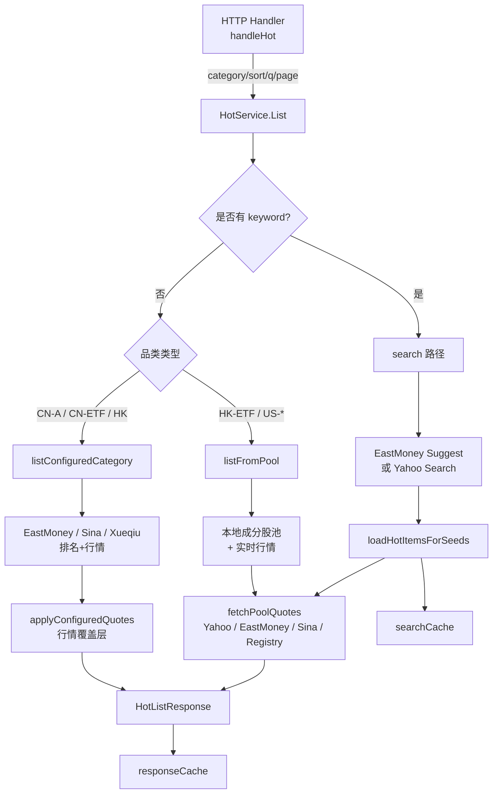
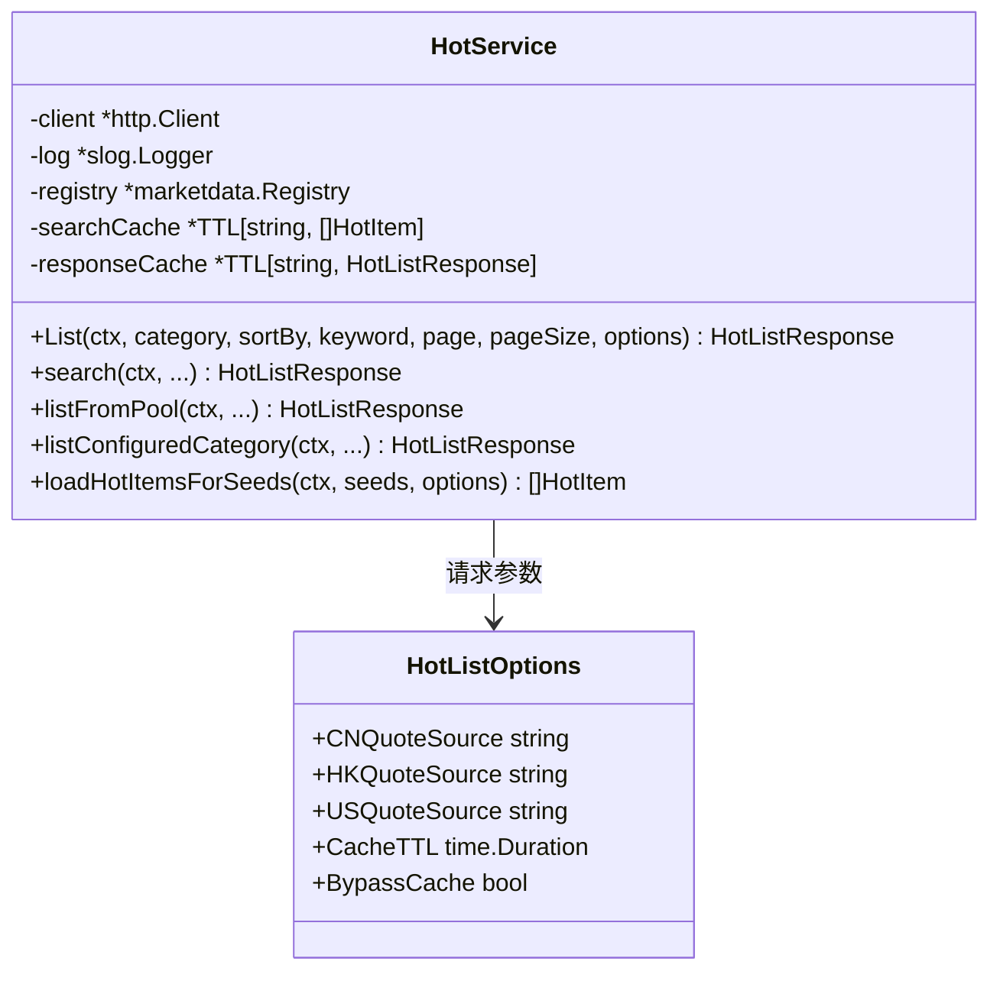
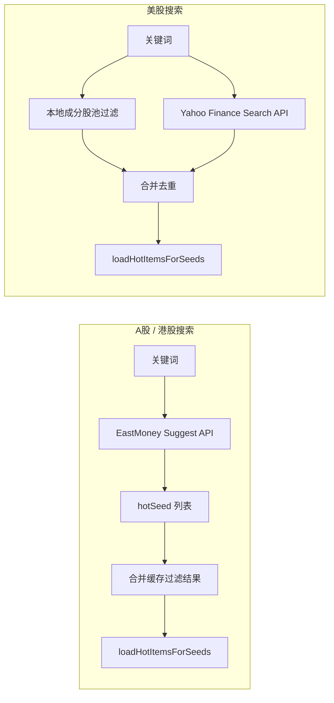

热门榜单服务为应用提供跨市场的实时热门行情浏览能力，覆盖 A 股、港股与美股的个股及 ETF 共八个细分品类。该模块的核心设计挑战在于：**不同市场的权威排名数据源各不相同，而用户又可通过设置自由切换行情来源**。因此，系统采用了「排名数据源与行情数据源分离」的架构——由专门的 upstream 提供榜单成员与排序，再通过统一的行情聚合层将用户偏好的行情提供商覆盖到榜单数据上，最终生成一致的 `HotListResponse`。本文将深入解析这一分层架构、多源路由策略、搜索机制与双层缓存设计。

Sources: [service.go](internal/core/hot/service.go#L30-L40)

## 服务架构概览

从高层视角看，热门榜单服务由四个协作层组成：**HTTP 接入层**、**分类路由层**、**排名/行情聚合层**与**多源 Provider 层**。`HotService` 作为中心调度器，根据品类、排序方式与关键词决定调用哪条数据路径；`category.go` 负责品类归一化与行情源解析；`pool.go` 与 `eastmoney.go`、`sina.go`、`xueqiu.go`、`yahoo.go` 分别实现不同市场的原始数据获取；`enrich.go` 则承担行情覆盖（overlay）职责，将用户配置的行情源重新映射到榜单成员上。

Sources: [service.go](internal/core/hot/service.go#L59-L101)

## 榜单分类与市场覆盖

系统定义了八个细分品类，映射到三个市场区域，每类支持五种排序维度。品类与排序在核心模型中以强类型枚举定义，确保跨层传递时不会出现非法值。

| 品类 (HotCategory) | 市场 | 成员来源 | 默认行情源 |
|---|---|---|---|
| `cn-a` | A 股主板+创业板+科创板 | EastMoney / Sina / Xueqiu 排名 | `sina` |
| `cn-etf` | 沪深 ETF | EastMoney / Sina / Xueqiu 排名 | `sina` |
| `hk` | 港股主板+创业板 | EastMoney / Xueqiu 排名 | `xueqiu` |
| `hk-etf` | 港股 ETF | 本地维护池 | `tencent`* |
| `us-sp500` | 标普 500 | 本地维护池 | `yahoo` |
| `us-nasdaq` | 纳斯达克 100 | 本地维护池 | `yahoo` |
| `us-dow` | 道琼斯 30 | 本地维护池 | `yahoo` |
| `us-etf` | 美股 ETF TOP100 | 本地维护池 | `yahoo` |

\* `hk-etf` 存在特殊兜底：当用户未修改配置且使用默认 `eastmoney` 时，系统会强制降级到 `tencent`，因为 EastMoney 的港股 ETF 推送接口可靠性不足。

排序维度包括 `volume`（成交额）、`gainers`（涨幅榜）、`losers`（跌幅榜）、`market-cap`（市值）与 `price`（价格）。不同 upstream 将各自的排序字段映射到这五个统一维度上。

Sources: [model.go](internal/core/model.go#L195-L218), [category.go](internal/core/hot/category.go#L61-L82)

## HotService 核心设计

`HotService` 是一个无状态服务实例，通过 `NewHotService` 注入 `http.Client`、日志器与行情注册表 `*marketdata.Registry`。其设计亮点是**双层 TTL 缓存**与**选项化配置**的结合。`HotListOptions` 结构体承载了每次请求的市场级行情源偏好（`CNQuoteSource`、`HKQuoteSource`、`USQuoteSource`）、缓存存活时间与是否跳过缓存的标志位。服务层本身不感知全局设置，而是由 HTTP Handler 将 `AppSettings` 中的用户偏好转换为 `HotListOptions` 后传入，这使得服务层易于在测试环境中独立驱动。

Sources: [service.go](internal/core/hot/service.go#L22-L56)

## 数据源路由策略

热门榜单采用了**「排名源」与「行情源」可独立切换**的策略。对于 A 股与港股，系统内置了 EastMoney、Sina、Xueqiu 三个排名源，它们直接返回包含实时价格的榜单页；如果用户选择的行情源与当前排名源不一致，则触发 `applyConfiguredQuotes` 进行行情覆盖。对于美股与港股 ETF，由于缺少免费且稳定的实时排名 API，系统采用**本地维护的成分股池**作为成员列表，再通过用户偏好的行情源批量拉取实时报价。

`listConfiguredCategory` 是调度中枢：当用户选择 Yahoo 作为 A 股或港股行情源时，系统直接拒绝，因为 Yahoo 并不提供这两个市场的整市场排名 API；当用户选择的源支持当前品类的排名接口时，直接调用该源；否则，使用默认排名源获取成员，再通过行情覆盖层替换价格数据。`membershipSourceForCategory` 定义了默认排名源映射：A 股默认 `sina`，港股默认 `xueqiu`。

Sources: [service.go](internal/core/hot/service.go#L276-L288), [category.go](internal/core/hot/category.go#L84-L106)

## 多源行情聚合机制

行情聚合分为两条主线：**池化报价**（`fetchPoolQuotes`）与**覆盖报价**（`applyConfiguredQuotes`）。池化报价面向美股品类与港股 ETF，从本地种子列表出发，按用户配置的行情源批量获取实时数据。支持的源包括 Yahoo、EastMoney、Sina，以及通过 `marketdata.Registry` 动态查找的任意已注册 Provider（如 Alpha Vantage、Twelve Data、Finnhub、Polygon 等）。

`fetchPoolQuotes` 内部实现了各源的批量请求优化：Yahoo 使用带并发限制的逐条请求（`yahooHotConcurrency = 5`），因为 Yahoo Chart API 的批量能力有限；EastMoney 通过 `secid` 分批查询（每批最多 50 个，且受 URL 长度约束）；Sina 则采用 50 个代码为一组的并发批次（`sinaPoolConcurrency = 4`）。对于其他注册 Provider，统一走 `fetchPoolQuotesWithProvider`，将 `hotSeed` 转换为 `WatchlistItem` 后调用标准 `QuoteProvider.Fetch`。

覆盖报价则用于 A 股与港股场景：先用默认排名源（如 Sina）获取一页带价格的榜单，再用用户指定的 Provider（如 Twelve Data）重新获取这批成员的实时行情，最后将名称、价格、涨跌幅、成交量、市值等字段覆盖到原列表上。若覆盖后的源与原源一致，则跳过冗余请求。

Sources: [pool.go](internal/core/hot/pool.go#L38-L61), [enrich.go](internal/core/hot/enrich.go#L14-L39)

## 搜索实现策略

搜索路径根据市场特性采用了完全不同的技术方案，体现了「能用服务端过滤就不用全量拉取」的优化原则。

**A 股与港股搜索**使用东方财富 Suggest API。该接口通过单次轻量请求返回与关键词匹配的股票代码与名称，无需下载数千条全量数据后再本地过滤。`searchEastMoneySeeds` 将 Suggest 结果转换为 `hotSeed`，同时还会从 `searchCache` 中读取该品类之前的缓存榜单进行本地过滤合并，以补充 Suggest API 可能遗漏的已浏览条目。

**美股搜索**采用「本地池过滤 + Yahoo Finance 搜索 API」的混合策略。对于美股个股，先从本地成分股池中按 symbol/name 过滤，再调用 Yahoo 搜索 API 扩大覆盖范围（例如按公司名称匹配本地池名称中不包含的条目），最后合并去重。对于美股 ETF，逻辑类似，但额外过滤 `quoteType` 为 ETF 的结果。Yahoo 搜索请求会遍历多个可用域名（`YahooSearchHosts`），返回首个成功响应，以应对单域名限流或失效的情况。

Sources: [service.go](internal/core/hot/service.go#L106-L123), [eastmoney.go](internal/core/hot/eastmoney.go#L225-L291), [yahoo.go](internal/core/hot/yahoo.go#L30-L98)

## 排序与分页

排序与分页发生在两个不同阶段。对于排名 API 驱动的品类（A 股、港股），上游直接返回按指定维度排序后的分页结果，服务端仅需透传。对于池化品类（美股、港股 ETF），由于行情源返回的是无序报价，系统在 `loadPoolItems` 中先获取全量实时数据，再通过 `sortHotItems` 在内存中按 `HotSort` 进行稳定排序，最后通过 `paginateHotItems` 切片返回。

`sortHotItems` 使用 Go 标准库的 `sort.SliceStable`，确保相同键值的条目保持原始顺序。分页函数处理了越界、零值与负值等边界情况：当 `page` 小于 1 时归一化为 1；当 `start` 超过总数时返回空切片；当 `end` 超过总数时截断至末尾。

Sources: [sort.go](internal/core/hot/sort.go#L11-L50)

## 成分股池管理

美股与港股 ETF 的成员并非来自实时排名 API，而是维护在代码中的静态成分股池。`hotConstituents` 以 `map[core.HotCategory][]hotSeed` 的形式存储了标普 500、纳斯达克 100、道琼斯 30 与美股 ETF TOP100 的种子列表；`hkETFConstituents` 则单独维护了一份精选的港股 ETF 代码池。每个 `hotSeed` 包含 Symbol、Name、Market 与 Currency 四个字段，后续通过 `normalizedUSHotSeeds` 将裸代码转换为带市场标识的标准种子。

美股成分股池的维护成本较高，因为 S&P 500 等指数成分会定期调整。代码中使用了 `usStockSeeds` 与 `usETFSeeds` 辅助函数批量生成种子，并为每个代码提供了 `usEquitySeedNames` 映射作为回退名称，防止行情源返回空名称时前端无法展示。

Sources: [constituent.go](internal/core/hot/constituent.go#L8-L52), [constituent.go](internal/core/hot/constituent.go#L613-L658)

## 双层缓存设计

为了在高频翻页与重复搜索场景下降低上游压力，`HotService` 维护了两层 TTL 缓存，默认过期时间为 60 秒。

**Response Cache**（`responseCache`）以完整的请求参数组合为键，缓存最终返回给前端的 `HotListResponse`，适用于用户反复翻页、切换排序或刷新同一榜单的场景。缓存命中时，`Cached` 字段会被标记为 `true`，并附带 `CacheExpiresAt` 时间戳供前端展示。

**Search Cache**（`searchCache`）以「品类 + 排序 + 行情源」为键，缓存某品类下的全量可搜索条目（`[]HotItem`），主要用于搜索时的本地过滤与兜底。当用户使用关键词搜索时，若 EastMoney Suggest 返回结果不足，系统会从该缓存中按关键词本地过滤并合并到搜索结果中，提升搜索体验的连贯性。

`cache.go` 中的 `listAllSearchableItems` 是 Search Cache 的填充入口：对于排名驱动品类，它会通过 `fetchAllHotPages` 逐页拉取完整榜单（每页 200 条，直到 `HasMore` 为 false），排序后写入缓存；对于池化品类，则直接加载本地池并获取实时行情后缓存。两个缓存层均使用 `internal/common/cache` 包中的泛型 TTL 缓存实现，支持并发安全访问。

Sources: [cache.go](internal/core/hot/cache.go#L13-L54), [cache.go](internal/core/hot/cache.go#L56-L93)

## 与 HTTP API 的集成

HTTP Handler `handleHot` 是前端与热门榜单服务的唯一入口。它从查询参数中解析品类、排序、关键词、页码与页大小，再从 `AppSettings` 中读取用户配置的行情源与缓存 TTL，组装为 `HotListOptions` 后调用 `HotService.List`。`BypassCache` 标志由 `force` 查询参数控制，供用户手动刷新时跳过缓存。返回的 `HotListResponse` 会经过 `localizeHotList` 进行本地化字段映射后写入 JSON 响应。

Sources: [handler.go](internal/api/handler.go#L104-L132)

## 延伸阅读

理解热门榜单服务的数据流后，建议继续阅读以下相关模块的文档：

- 若希望了解行情 Provider 的注册与动态路由机制，请参阅 [行情数据 Provider 注册与路由机制](7-xing-qing-shu-ju-provider-zhu-ce-yu-lu-you-ji-zhi)。
- 若需深入各 Provider（如 Yahoo、Sina、Xueqiu、EastMoney）的实现细节，请参阅 [东方财富与新浪行情 Provider](25-dong-fang-cai-fu-yu-xin-lang-xing-qing-provider) 与 [Yahoo Finance 与腾讯财经 Provider](26-yahoo-finance-yu-teng-xun-cai-jing-provider)。
- 若对 Store 层的状态管理与设置持久化感兴趣，请参阅 [Store 核心状态管理与持久化](6-store-he-xin-zhuang-tai-guan-li-yu-chi-jiu-hua)。
- 若需了解 HTTP 路由与请求处理的完整上下文，请参阅 [HTTP API 路由与请求处理](5-http-api-lu-you-yu-qing-qiu-chu-li)。