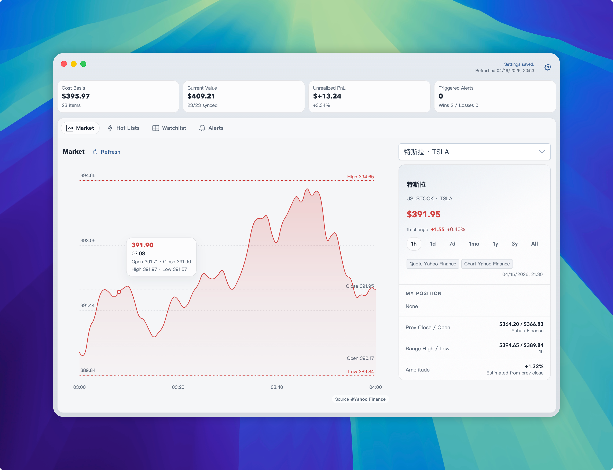
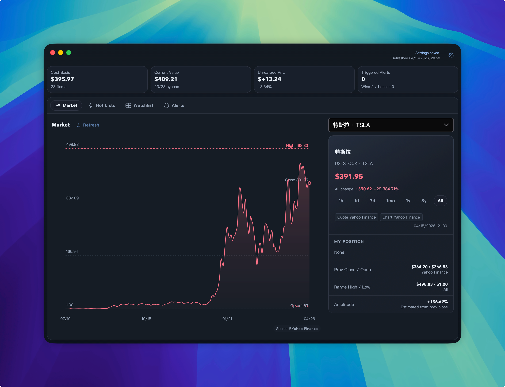
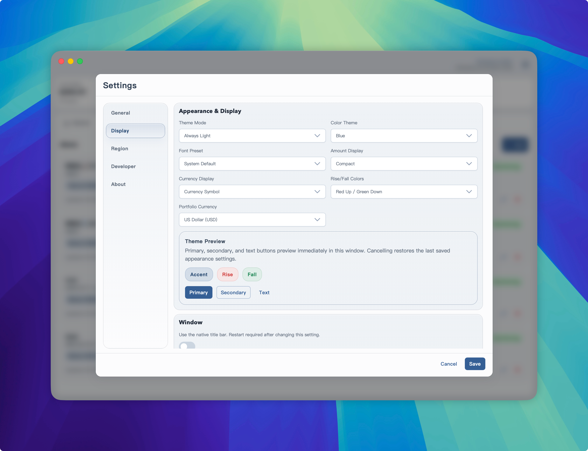

# InvestGo

[English](./README.md) | [简体中文](./README.zh-CN.md) | [License](./LICENSE)

InvestGo is a desktop investment watchlist application built with Go and Wails v3. It supports watchlists, real-time quotes, historical charts, hot lists, and price alerts.

## Screenshots








## Quick Start

```bash
git clone https://github.com/Johnny0x38E/InvestGo.git
cd InvestGo
npm install
npm run dev           # Frontend development server (localhost:5173)
go run main.go -dev   # Backend development
```

## Build

```bash
VERSION=0.1.0 ./scripts/build-macos-arm64.sh
./scripts/build-macos-arm64.sh --dev
./scripts/package-macos-dmg.sh
```

## Requirements

- Go 1.25+
- Node.js 20+
- macOS arm64

## Disclaimer

**IMPORTANT NOTICE**: This software is intended for personal learning and investment observation purposes only and does not constitute any form of investment advice, financial advice, or a recommendation to buy or sell.

Users should independently verify the accuracy and completeness of all data, information, and functions provided by this software. The authors and contributors assume no liability for:

1. Any investment losses or gains resulting from the use of this software
2. The accuracy, timeliness, or completeness of the data provided
3. Data interruptions or errors caused by network failures, data source changes, or other technical issues
4. Any outcomes from investment decisions based on information from this software

Investment involves risks. Users should fully understand the risks before using this software and assume full responsibility for all consequences of their investment decisions.

## License

This project is licensed under the [MIT License](./LICENSE).
