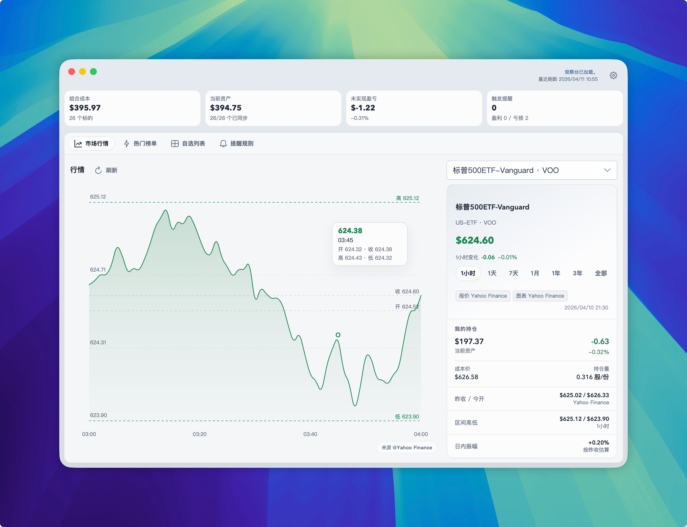
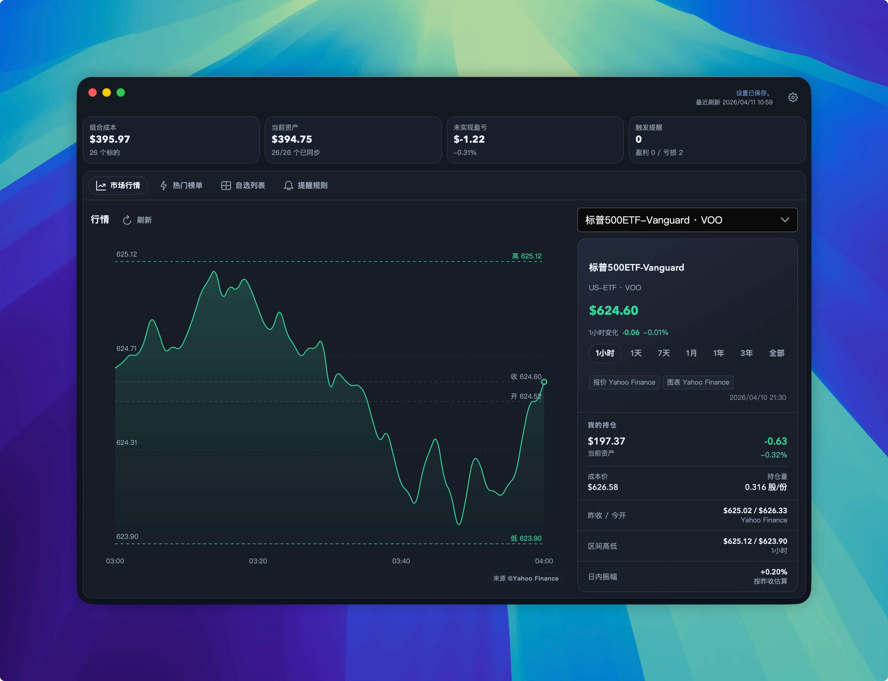
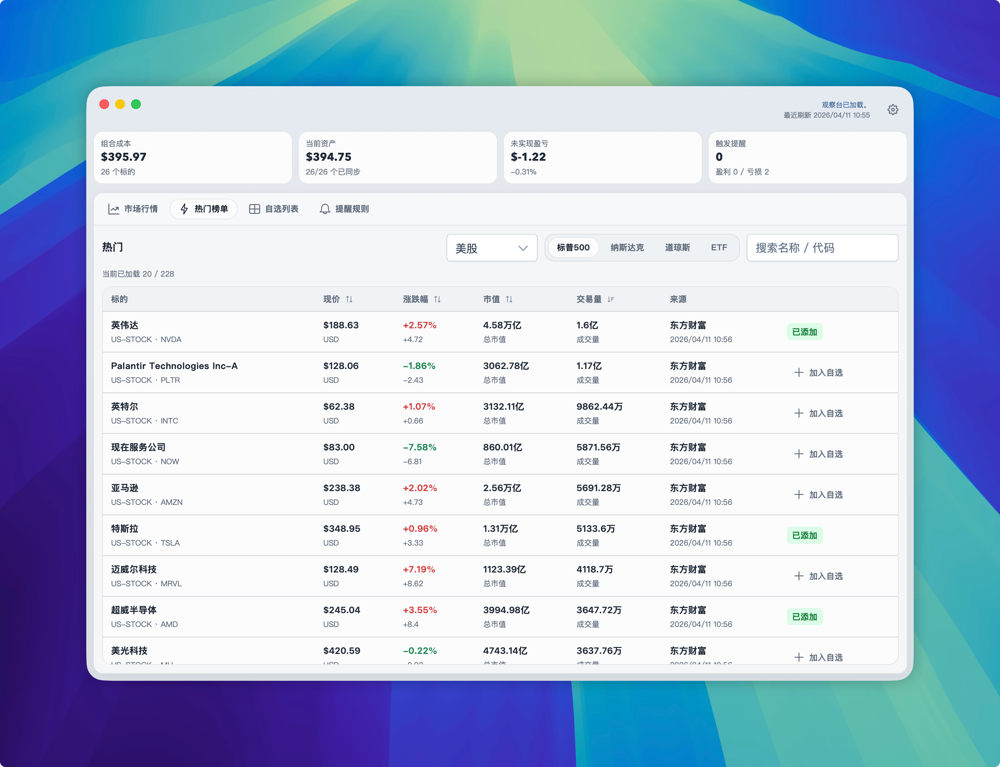
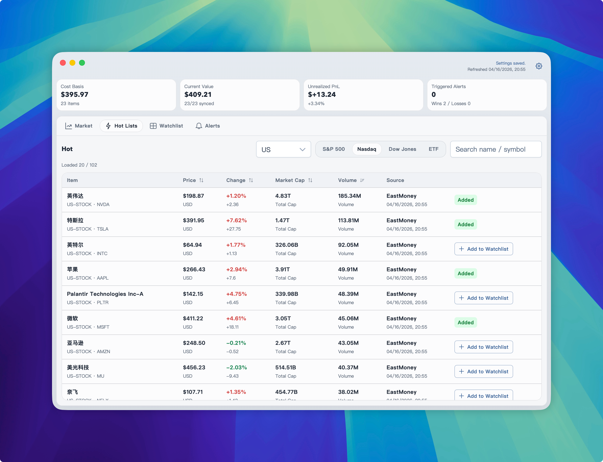
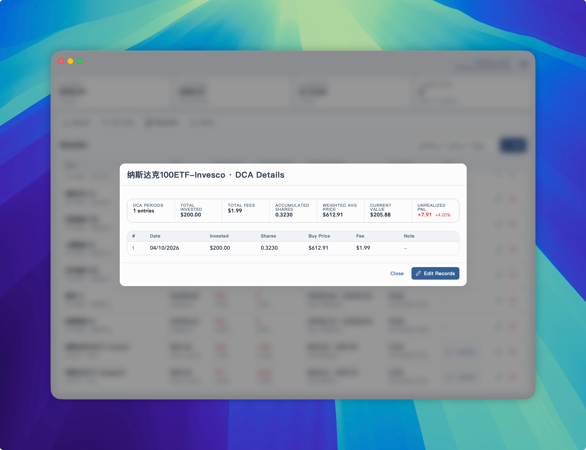
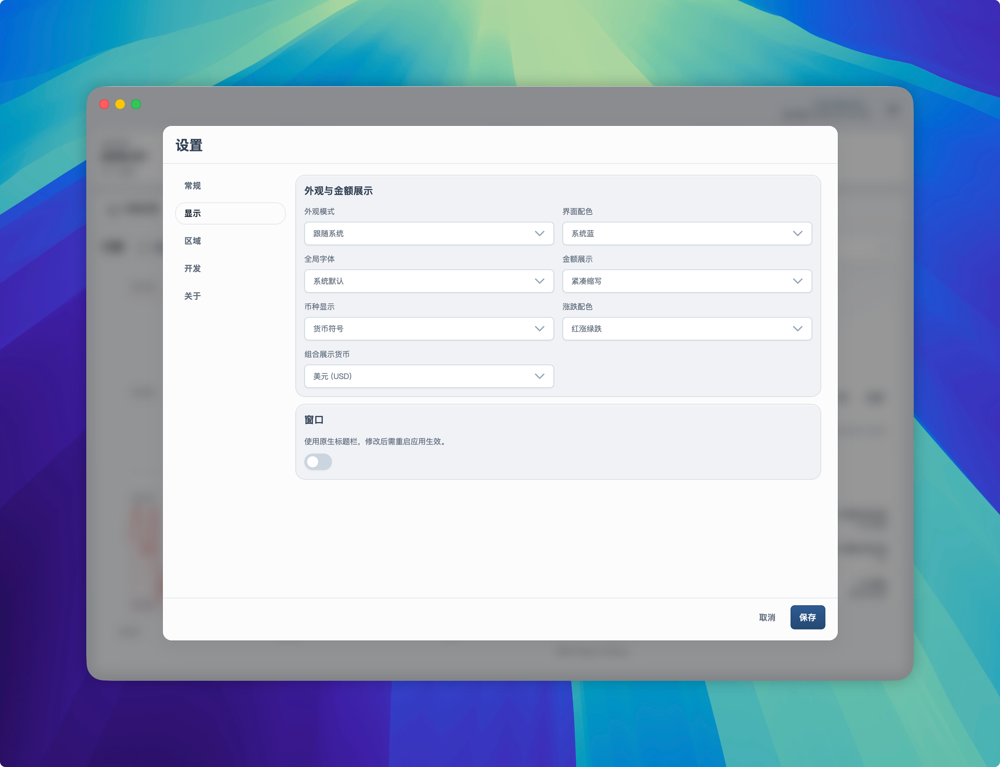

# InvestGo

个人投资观察桌面应用（Go + Wails v3）。支持自选标的、实时行情、历史走势、热门榜单及价格提醒。

## Screenshots













## Quick Start

```bash
git clone https://github.com/Johnny0x38E/InvestGo.git
cd InvestGo
npm install
npm run dev     # 前端开发 (localhost:5173)
go run main.go -dev  # 后端开发
```

## Build

```bash
VERSION=0.1.0 ./scripts/build-macos-arm64.sh        # 生产构建
./scripts/build-macos-arm64.sh --dev                # 调试构建 (F12 DevTools)
./scripts/package-macos-dmg.sh                      # 打包 .app + .dmg
```

## Requirements

- Go 1.25+
- Node.js 20+
- macOS arm64

## Disclaimer

### 中文

**重要提示**：本软件仅用于个人学习和投资观察目的，不构成任何形式的投资建议、财务建议或买卖建议。

使用本软件所提供的所有数据、信息和功能，用户应当自行判断其准确性和完整性。作者和贡献者不对以下情况承担任何责任：

1. 因使用本软件而产生的任何投资损失或收益；
2. 本软件所提供数据的准确性、及时性或完整性；
3. 因网络故障、数据源变更或其他技术问题导致的数据中断或错误；
4. 任何基于本软件信息做出的投资决策的结果。

投资有风险，入市需谨慎。用户在使用本软件前应充分了解投资风险，并自行承担所有投资决策的后果。

### English

**IMPORTANT NOTICE**: This software is intended for personal learning and investment observation purposes only and does not constitute any form of investment advice, financial advice, or recommendation to buy or sell.

Users should independently verify the accuracy and completeness of all data, information, and functions provided by this software. The authors and contributors assume no liability for:

1. Any investment losses or gains resulting from the use of this software;
2. The accuracy, timeliness, or completeness of the data provided;
3. Data interruptions or errors caused by network failures, data source changes, or other technical issues;
4. Any outcomes from investment decisions based on information from this software.

Investment involves risks. Users should fully understand the investment risks before using this software and assume full responsibility for all consequences of their investment decisions.

## License

MIT
