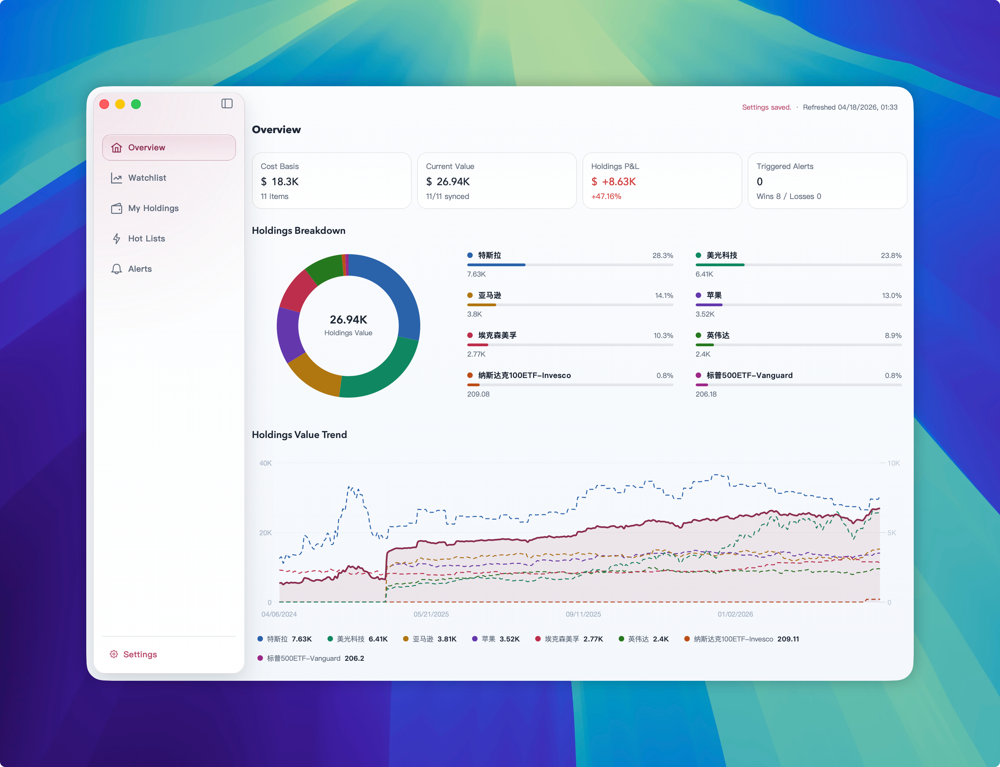
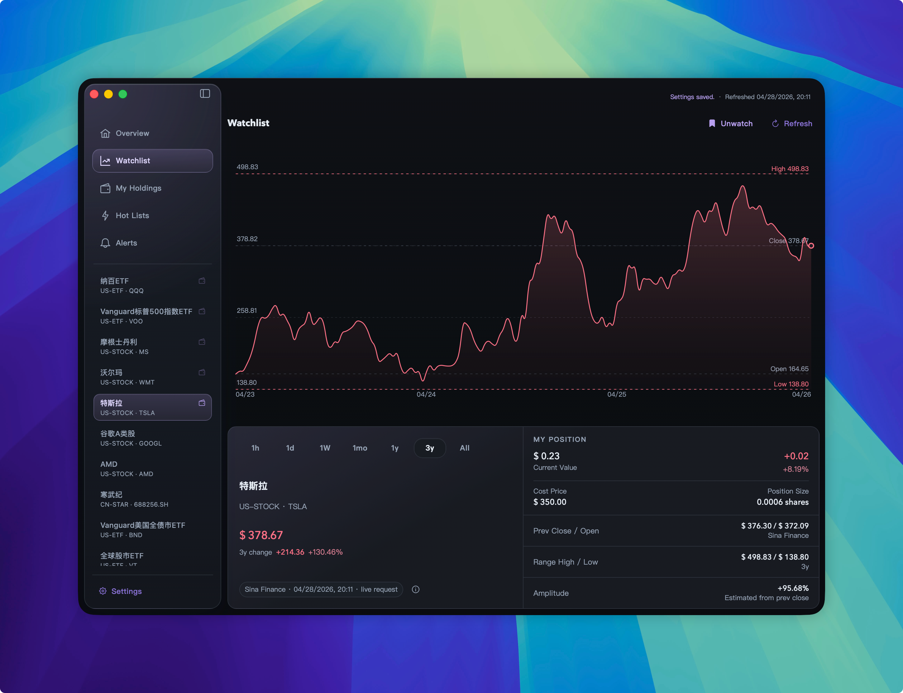

# InvestGo

[English](./README.md) | [简体中文](./README.zh-CN.md) | [License](./LICENSE)

InvestGo is a Wails desktop investment tracker for watchlists, holdings, portfolio analytics, hot lists, historical charts and price alerts.

InvestGo uses Wails mainly as a lightweight desktop container for a Go backend and Vue frontend. The packaged desktop app does not need to ship its own Chromium and Node.js runtime like Electron. For this project shape, Wails can usually deliver a much smaller app bundle, lower idle memory usage, and faster startup than an equivalent Electron app, while still providing native windowing, embedded assets, lifecycle hooks, DevTools support, and platform integration.

> - Electron has enabled many excellent cross-platform desktop applications, but it has also made repeatedly bundling the browser runtime a common overhead on many everyday devices. We need more lightweight cross-platform desktop solutions, reusing the system WebView as much as possible and keeping the native backend lean.
> - This project currently targets Wails v3 alpha.74. Wails v3 is still an alpha release, so official APIs, runtime behaviour, and build details may change in future Wails releases.
> - InvestGo is primarily a personal-use and learning project. It is open-sourced for reference, but long-term maintenance, compatibility, and feature roadmap are not guaranteed.

## Screenshots

| Light                      | Dark                     |
| -------------------------- | ------------------------ |
|  |  |

## Tech Stack

- Backend: Go 1.26, Wails v3 alpha.74, standard HTTP handlers.
- Frontend: Vue 3, TypeScript, PrimeVue 4, Vite 8, Chart.js 4.
- Market data: EastMoney, Yahoo Finance, Sina Finance, Xueqiu, Tencent Finance, Alpha Vantage, Twelve Data, Finnhub, Polygon.
- FX data: Frankfurter.
- macOS packaging: shell scripts plus `swift`, `sips`, `iconutil`, `hdiutil`, and `ditto`.

## Architecture

The repository is not a monorepo. The Go module root is the repository root, and the frontend lives in `frontend/`.

- `main.go` embeds `frontend/dist` and `build/appicon.png`, creates the Wails v3 application, wires platform settings, and serves one HTTP mux.
- `/api/*` routes are handled by `internal/api`. The frontend talks to the backend with normal `fetch()` calls from `frontend/src/api.ts`; it does not use Wails JS bindings for app data.
- `internal/core/store` owns persisted state, runtime status, quote refreshes, history cache, overview analytics, alert evaluation, and JSON storage.
- `internal/core/marketdata` registers quote and history providers and builds the history router.
- `internal/core/provider` contains provider implementations.
- `internal/core/hot` owns hot-list pools, caching, enrichment, and sorting.
- `internal/platform` isolates desktop platform seams such as proxy detection and window options.
- `internal/logger` stores backend and frontend developer logs.

Persisted state defaults to:

- macOS: `~/Library/Application Support/investgo/state.json`

Developer logs default to:

- macOS: `~/Library/Application Support/investgo/logs/app.log`

## Development

Prerequisites:

- Node.js 20+
- Go 1.26+
- macOS 13+ on Apple Silicon for the current desktop build and packaging scripts

Install dependencies:

```bash
npm install
```

Run the frontend dev server:

```bash
npm run dev
```

The dev server runs on port 5173. It does not provide the Wails runtime, so `frontend/src/wails-runtime.ts` must remain nullable-safe.

Run checks:

```bash
npm run typecheck
env GOCACHE=/tmp/go-build-cache go test ./...
```

Build the frontend bundle:

```bash
npm run build
```

Build the desktop binary:

```bash
./scripts/build-darwin-aarch64.sh
VERSION=1.0.0 ./scripts/build-darwin-aarch64.sh
./scripts/build-darwin-aarch64.sh --dev
```

The build script renders `build/appicon.png`, runs `npm run build`, and outputs `build/bin/investgo-darwin-aarch64`.

Build script environment variables:

- `VERSION`
- `APP_VERSION`
- `OUTPUT_FILE`
- `MACOS_MIN_VERSION`
- `GOCACHE`
- `MACOSX_DEPLOYMENT_TARGET`
- `CGO_CFLAGS`
- `CGO_LDFLAGS`

## Package

Package the app bundle and DMG:

```bash
./scripts/package-darwin-aarch64.sh
VERSION=1.0.0 ./scripts/package-darwin-aarch64.sh
./scripts/package-darwin-aarch64.sh --dev
```

Outputs:

- `build/macos/InvestGo.app`
- `build/bin/investgo-<version>-darwin-aarch64.dmg`

Packaging script environment variables:

- `APP_NAME`
- `BINARY_NAME`
- `VERSION`
- `APP_ID`
- `MACOS_MIN_VERSION`
- `VOLUME_NAME`
- `ICON_SOURCE`
- `APPLE_SIGN_IDENTITY`
- `NOTARYTOOL_PROFILE`
- `SKIP_APP_BUILD`
- `SKIP_DMG_CREATE`

## Runtime Notes

- `--dev` enables terminal logging and F12 Web Inspector support at build time. F12 still requires the in-app `developerMode` setting to be enabled.
- Version is injected with `-X main.appVersion=$APP_VERSION`. Without `VERSION` or `APP_VERSION`, the app reports `dev`.
- Proxy mode can be `none`, `system`, or `custom`. System proxy detection currently probes `scutil --proxy` only on macOS.
- Frontend visible copy is bilingual. User-facing text changes should update both `zh-CN` and `en-US` entries in `frontend/src/i18n.ts`.
- There are no frontend tests. Use `npm run typecheck` for frontend validation and Go tests under `internal/**` for backend validation.

## Disclaimer

1. Any investment losses or gains resulting from the use of this software.
2. The accuracy, timeliness, or completeness of the data provided.
3. Data interruptions or errors caused by network failures, data source changes, or other technical issues.
4. Any outcomes from investment decisions based on information from this software.

## License

This project is open-sourced under the [MIT License](./LICENSE).
